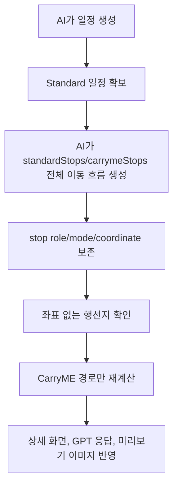

# 사용자 흐름과 상태 설계

## 결론

Standard 일정은 사용자가 짐 때문에 호텔/숙소에 먼저 들르는 기본 일정이다.
CarryME 일정은 같은 여행에서 사람이 호텔/숙소 중간 방문을 하지 않고 바로 관광지 또는 최종 목적지로 이동하는 경로다.
행선지 편집은 `출발지`, `방문지`, `숙소`, `복귀지`를 포함한 일자별 전체 이동 흐름이다.
따라서 구현은 AI가 내려준 전체 이동 흐름과 역할을 보존하고, CarryME 경로만 다시 계산한다.

## 이유

현재 문제는 CarryME가 "짐 없이 이동하는 사람의 경로"인지 "짐이 이동하는 흐름"인지 화면에서 섞여 보이는 데 있다.
사용자가 비교해야 하는 값은 Standard 대비 사람이 얼마나 덜 돌아가는지다.
Standard가 비교 기준으로 유지되어야 절약 시간이 `Standard 총 이동 시간 - CarryME 총 이동 시간`으로 일관된다.
행선지 편집에서 역할이 보존되어야 첫 방문지가 출발지로 표시되는 문제가 재발하지 않는다.

## 기본 흐름

## 상태 모델

| 상태 | 의미 | 사용자 표시 |
| --- | --- | --- |
| 기본 표시 | 저장된 Standard/CarryME 일정이 표시되는 상태 | 기존 일정 정보 표시 |
| CarryME 재계산 성공 | 호텔/숙소 중간 방문을 제거한 CarryME 경로 계산 성공 | 재계산된 CarryME 경로/시간과 절약 문구 표시 |
| CarryME 재계산 실패 | CarryME 경로 계산 결과를 신뢰할 수 없는 상태 | 오류 대신 Standard와 같은 경로/시간, `시간 절약 없음 · 짐 없이 바로 이동` 표시 |
| 절약 없음 | CarryME 시간이 Standard보다 짧지 않은 상태 | `시간 절약 없음 · 짐 없이 바로 이동` 표시 |
| 행선지 확인 필요 | stop role이 누락됐거나 좌표가 없어 provider 계산이 불가능한 상태 | 해당 행선지 확인 안내, 경로 재계산 차단 |

## 행선지 편집 상태

행선지 편집 rows는 route stop의 role과 mode를 보존한다.
화면 라벨은 index가 아니라 role에서 온다.

| role | 화면 의미 |
| --- | --- |
| `출발지` | 해당 일자의 이동 시작점 |
| `방문지` | 관광지, 식사 장소, 경유지 등 |
| `숙소` | 사람이 숙박하거나 실제로 들르는 숙소 |
| `복귀지` | 마지막 날 처음 출발지로 돌아가는 지점 |

숙소는 그날 마지막 row여도 `도착지`가 아니라 `숙소`로 표시한다.
`짐 숙소 도착`은 타임라인 이벤트이며 행선지 편집 role이 아니다.

## 실패 fallback

CarryME 경로 재계산이 실패하면 사용자는 실패 원인을 해결할 수 없다.
이 경우 경로 확인 실패를 화면 전면 오류로 보여주지 않고, CarryME 경로와 시간을 Standard와 동일하게 표시한다.
절약 시간은 0으로 보고 `시간 절약 없음 · 짐 없이 바로 이동`을 사용한다.

다만 role 누락이나 좌표 누락처럼 사용자가 행선지 편집에서 해결할 수 있는 상태는 재계산 실패 fallback과 구분한다.
이 경우는 provider 호출 전에 차단하고, 기존 장소 검색/상세 조회 흐름으로 좌표를 확정하게 한다.

## 최종 목적지가 호텔/숙소인 경우

호텔/숙소가 여행의 최종 목적지라면 CarryME 여행자 경로에서 제거하지 않는다.
제거 대상은 중간에 들르는 호텔/숙소 방문이다.
최종 목적지 자체를 제거하면 여행 종료 지점이 사라져 경로 의미가 깨진다.

행선지 편집이 전체 이동 흐름으로 확장됐기 때문에, "숙소 제거"는 무조건 삭제가 아니다.
CarryME 여행자 경로에 필요 없는 중간 짐 경유 숙소만 제외한다.
사람이 실제로 숙박하거나 출발/도착 기준으로 사용하는 숙소는 `숙소` role로 유지한다.
이 규칙은 편집 화면에서 숙소를 숨긴다는 뜻이 아니다.
Standard stops와 CarryME stops가 서로 다른 여행자 이동 흐름을 표현해야 한다는 뜻이다.

## 비목표

- Standard 경로를 다시 계산하지 않는다.
- CarryME 실패를 사용자 오류로 강조하지 않는다.
- 배송 차량 경로를 별도 점선으로 표시하지 않는다.
- 기존 Redis preview 저장값을 직접 수정하지 않는다.
- 좌표 보강을 위해 기존 장소 검색/상세 조회와 별개의 새 장소 검색 체계를 만들지 않는다.

## 코드 근거

- [ItineraryDashboard.tsx](../../../../apps/web/components/itinerary/ItineraryDashboard.tsx) - 상세 화면의 경로 재계산, 절약 라벨, computed route 적용 위치.
- [generated-itineraries.ts](../../../../packages/planme-core/src/generated-itineraries.ts) - 생성 일정의 Standard/CarryME route plan과 timeline 구성 위치.
- [draft-itineraries.ts](../../../../packages/planme-core/src/draft-itineraries.ts) - GPT 초안 정규화와 CarryME route plan 구성 위치.

## 리스크

- 경로 제공자가 좌표나 polyline을 충분히 주지 않으면 CarryME 재계산은 실패할 수 있다.
- 이 리스크는 사용자에게 오류로 보이지 않게 fallback으로 흡수한다.
- GUI-108의 한국 경로 제한과 GUI-157의 장거리 대중교통 partial route 이슈가 같은 실패 조건에 영향을 줄 수 있다.
