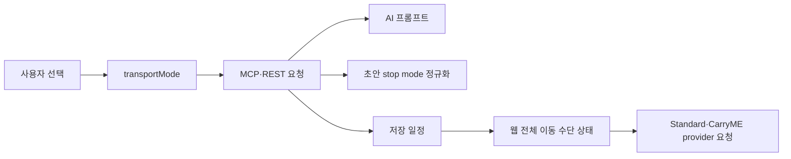

# MCP 일정 전체 이동 수단 계약 설계

## 결론

일정 전체 이동 수단(`transportMode`)을 자동차(`drive`) 또는 대중교통(`transit`) 중 하나로 정의하고, MCP 준비 도구부터 GPTs Actions, AI 생성, 저장 일정, 웹 재계산까지 동일한 기준값으로 전달한다.
행선지별 `mode`는 AI가 결정하는 독립 값이 아니라 일정 전체 이동 수단에서 코드가 파생하는 값으로 바꾼다.

자연어 문장은 PlanME 서버가 정규식으로 해석하지 않는다.
ChatGPT가 사용자 대화에서 이동 수단이 명확하면 구조화된 값을 전달하고, 값이 없거나 자동차·대중교통이 섞였으면 일정 준비 도구가 확정된 사용자 문구를 반환한다.

## 이유

- 현재 준비 도구에는 이동 수단 slot이 없어 출발지·목적지·기간이 있으면 일정 생성으로 넘어갈 수 있다.
- 현재 추천 요청에는 일정 전체 이동 수단 필드가 없다.
- AI structured output은 각 stop에 `mode`를 직접 쓰므로 같은 일정에 자동차와 대중교통이 섞일 수 있다.
- 웹 경로 계산은 출발 row의 `mode`를 구간별로 읽기 때문에 전체 이동 수단 변경이 단일 상태로 표현되지 않는다.
- 프롬프트만으로 전체 구간 통일을 보장하면 모델 출력 오류가 그대로 저장될 수 있다.

## 타입 계약

```ts
export type PlanmeTransportMode = "drive" | "transit";
```

### 일정 준비 입력

```ts
type PlanmePlanningRequest = {
  message?: string;
  destination?: string;
  origin?: string;
  durationDays?: number;
  transportMode?: PlanmeTransportMode;
  // 기존 선택 입력 생략
};
```

준비 입력에서는 `transportMode`가 optional이다. 값이 없으면 질문을 만들기 위해서다.

### 일정 생성 입력

```ts
type RecommendItineraryRequest = {
  destination: string;
  origin?: string;
  arrivalAirport?: string;
  durationDays: number;
  transportMode: PlanmeTransportMode;
  // 기존 선택 입력 생략
};
```

일정 생성 단계에서는 `destination`, `durationDays`, `transportMode`가 필수다.
출발지는 `origin` 또는 기존 `arrivalAirport` 중 하나가 있어야 한다.
사용자 지정 목적지는 지역뿐 아니라 `경주월드` 같은 실제 장소일 수 있으므로 기존 `Region or city only` 설명을 제거한다.

### 일정 초안과 저장 데이터

```ts
type PlanmeDraftPreviewRequest = {
  transportMode: PlanmeTransportMode;
  // 기존 필드 생략
};

type PlanmeItinerary = {
  transportMode: PlanmeTransportMode;
  // 기존 필드 생략
};
```

기존 링크와 저장 데이터는 변환하지 않는다.
새로 생성하는 일정은 `transportMode`가 없으면 유효하지 않다.

## 일정 준비 질문 계약

`PlanmePlanningSlot`에 `transportMode`를 추가한다.

```ts
type PlanmePlanningSlot =
  | "destination"
  | "origin"
  | "durationDays"
  | "transportMode"
  | "hotelName"
  | "preferences";
```

`normalizedInput`에는 다음 값이 들어간다.

```ts
transportMode: PlanmeTransportMode | null;
```

필수 입력이 빠졌으면 필수 질문을 먼저 반환한다.
이동 수단이 없을 때 사용자 문구는 아래로 고정한다.

```text
일정 안내는 자동차와 대중교통만 지원합니다. 어떤 이동 수단으로 안내할까요?
```

예시는 `자동차`, `대중교통` 두 개다.
숙소·여행 취향 같은 선택 질문은 모든 필수 입력이 채워진 뒤에만 반환한다.

## 자연어 해석 경계

PlanME 서버는 `자차`, `렌터카`, `택시`, `KTX` 같은 표현을 직접 분류하지 않는다.

| 상황 | ChatGPT/MCP 클라이언트 동작 | PlanME 서버 동작 |
| --- | --- | --- |
| 사용자가 자동차 또는 대중교통을 명확히 선택 | `drive` 또는 `transit` 전달 | 값 검증 후 준비 완료 |
| 이동 수단 언급 없음 | 값 생략 | 이동 수단 질문 반환 |
| 자동차·대중교통이 함께 언급돼 하나로 확정 불가 | 값 생략 | 이동 수단 질문 반환 |
| 지원하지 않는 값 | 전달하지 않음 | 스키마 검증 실패 또는 질문 반환 |

이 경계는 서버의 자연어 정규식 목록이 사용자 표현 변화에 따라 계속 늘어나는 문제를 피한다.

## MCP 도구 계약

### 일정 준비 도구(`start_planme_planning`)

- 입력에 optional `transportMode`를 추가한다.
- 출력 `missingSlots`, `questions`, `normalizedInput`에 이동 수단을 추가한다.
- 값이 없으면 `status: "needs_input"`, `nextAction: "ask_user"`다.
- 사용자가 이미 명확한 값을 전달하면 다시 묻지 않는다.

### AI 일정 생성 도구(`recommend_planme_itinerary`)

- 입력에 required `transportMode`를 추가한다.
- description에 일정 준비 도구가 확정한 이동 수단을 그대로 전달하도록 명시한다.
- destination 설명을 지역 또는 사용자 지정 장소로 확장한다.
- 이동 수단 누락을 OpenAI 기본값이나 AI 추정으로 채우지 않는다.
- 응답의 일정 `_meta`와 상세 저장 payload에 `transportMode`를 포함한다.

## GPTs Actions REST/OpenAPI 계약

MCP와 REST의 스키마를 같은 순서로 갱신한다.

- `PlanmePlanningRequest.properties.transportMode`
- `PlanmePlanningAssessment.missingSlots` enum
- `PlanmePlanningQuestion.slot` enum
- `NormalizedPlanningInput.transportMode`
- `RecommendItineraryRequest.properties.transportMode`
- 일정 생성 요청의 required/conditional origin 검증
- 생성 응답의 `itinerary.transportMode`

MCP와 OpenAPI 중 한쪽만 바뀌면 Custom GPT와 Apps SDK가 서로 다른 질문·생성 기준을 가지므로 같은 변경 단위로 취급한다.

## AI 생성 계약

OpenAI 프롬프트에 선택한 전체 이동 수단을 명시한다.

```text
전체 이동 수단: 자동차(drive)
모든 Standard·CarryME 대표 이동 구간에 동일하게 적용합니다.
대중교통 내부 승하차 도보 구간은 provider 세부 구간이며 대표 이동 수단을 바꾸지 않습니다.
```

AI structured output에서 stop별 `mode` 결정을 제거하는 것을 추천한다.
코드는 AI 초안을 받은 뒤 모든 `standardStops`, `carrymeStops`, legacy `stops`에 `input.transportMode`를 주입한다.
기존 `RouteStop.mode`는 provider 호출 호환을 위한 파생 필드로 유지한다.

```ts
function applyTransportModeToDraft(
  draft: PlanmeDraftPreviewRequest,
  transportMode: PlanmeTransportMode,
): PlanmeDraftPreviewRequest;
```

마지막 stop도 기존 화면·검증 계약 단순화를 위해 같은 `mode`를 가진다.
provider 호출은 마지막 stop의 mode를 사용하지 않는다.

## 단일 기준값 규칙



- 사용자 선택이 유일한 원본 값이다.
- AI stop의 mode는 신뢰하지 않는다.
- 웹은 각 row mode를 독립 상태로 저장하지 않는다.
- Standard와 CarryME가 서로 다른 전체 이동 수단을 가질 수 없다.

## 도보 처리

- 사용자 선택지에 `walk`를 노출하지 않는다.
- MCP·REST 일정 전체 이동 수단 enum에 `walk`를 넣지 않는다.
- AI 대표 stop mode에 `walk`를 넣지 않는다.
- ODsay가 반환하는 접근·환승·하차 도보 구간은 공급자 내부 모드(`ProviderSegmentMode`)로 유지한다.
- 사용자 화면에 별도 `도보` 선택기나 전체 이동 수단 문구를 만들지 않는다.

## 오류 계약

| 조건 | 상태 | 처리 |
| --- | --- | --- |
| 준비 요청에 이동 수단 없음 | `needs_input` | 확정 문구와 두 선택지 반환 |
| 생성 요청에 이동 수단 없음 | 입력 오류 | 일정 생성과 OpenAI 호출 금지 |
| 지원하지 않는 이동 수단 | 입력 오류 | 허용값 안내, 기본값 사용 금지 |
| AI가 다른 stop mode 생성 | 내부 정규화 | 전체 이동 수단으로 덮어쓰기 |
| 웹에서 전체 이동 수단 변경 | 편집 대기 | 버튼을 누르기 전 provider 호출 금지 |

## 대안과 기각 이유

### AI가 stop별 mode를 직접 결정

기각한다. 모델 출력에 자동차·대중교통이 섞일 수 있고 사용자 선택이 보장되지 않는다.

### 첫 stop의 mode를 일정 전체 값으로 추정

기각한다. 누락·혼합 출력을 조용히 정상화해 오류를 숨길 수 있다.

### 서버에서 자연어 동의어를 정규식으로 분류

기각한다. 대화 문맥과 혼합 이동 수단을 안정적으로 판단하기 어렵고 표현 목록이 지속적으로 늘어난다.

### `walk`를 전체 이동 수단 enum에 유지

기각한다. 사용자 선택지는 자동차·대중교통 두 개로 확정됐다.

## 리스크

- MCP와 GPTs Actions OpenAPI를 동시에 바꾸지 않으면 클라이언트별 동작이 갈린다.
- 새 필수 필드로 인해 오래된 직접 호출 테스트가 실패한다. 기존 링크·클라이언트 호환은 비목표지만 테스트 fixture는 모두 갱신해야 한다.
- AI schema에서 mode를 제거하면 기존 정적 계약 검사와 fixture 변경 범위가 넓어진다.
- ChatGPT가 자연어를 잘못 구조화하면 사용자가 선택하지 않은 값이 들어올 수 있으므로 준비 도구 사용 지침과 계약 테스트가 필요하다.

## 검증 연결

- 이동 수단 누락 시 준비 질문 반환
- 명시된 이동 수단은 재질문하지 않음
- 생성 도구와 REST 요청에 `transportMode` 필수
- AI prompt에 전체 이동 수단 포함
- 모든 Standard·CarryME stop mode가 전체 이동 수단과 일치
- 웹 대표 이동 수단에 `walk` 없음
- 대중교통 공급자 내부 도보 구간은 유지
