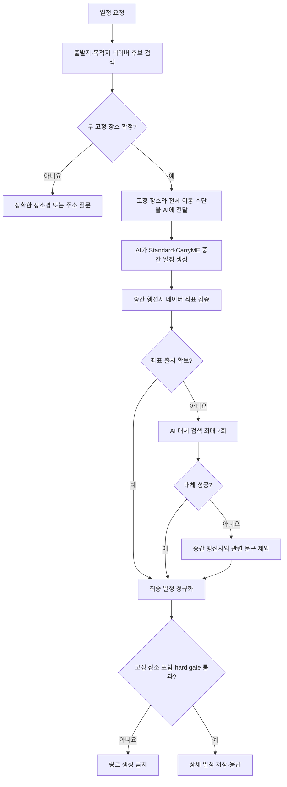

# 네이버 장소 좌표 보장 설계

## 결론

사용자 지정 출발지와 목적지는 AI 일정 생성 전에 네이버로 확인해 고정 장소(anchor)로 만든다.
AI는 고정 장소를 바꿀 수 없고, 두 고정 장소 사이의 중간 행선지만 생성한다.
중간 행선지 좌표가 없으면 AI가 같은 지역·일정 주제·장소 종류를 유지하는 후보를 최대 2회 다시 찾고, 모두 실패하면 해당 행선지를 Standard·CarryME·타임라인에서 함께 제외한다.

장소 검색 함수는 네이버 텍스트 검색 하나만 노출한다.
사용자 정의 함수 내부에서 네이버 지역 검색과 네이버 주소 좌표 변환 결과를 공통 후보로 정규화하며 Google Places와 주변 반경 검색은 사용하지 않는다.

## 이유

- 현재 `resolveDraftPlaceCandidatesIfPossible`은 출발지, 목적지, AI 중간 행선지를 같은 후보 검증 흐름으로 처리한다.
- 후보 검색에는 요청 목적지 지역이 들어가므로 출발지가 목적지 주변 방문지처럼 판단될 수 있다.
- 사용자 지정 목적지는 route role만 보면 일반 `방문지`와 구분되지 않는다.
- 일정 생성 후 이름 문자열만 비교하면 동의어, 행정구역 표기, 공급자 표시명 차이로 고정 장소가 바뀔 수 있다.
- 고정 장소를 먼저 검증하면 AI 생성 이후에는 중간 행선지 교체·제외만 처리할 수 있어 실패 정책이 단순해진다.

## 목표와 비목표

### 목표

- 출발지·사용자 지정 목적지의 좌표와 검색 출처 보장
- 출발지를 목적지 지역 후보로 오판하는 회귀 차단
- 사용자 지정 목적지의 일정 포함 보장
- 출발지 좌표를 마지막 날 복귀지에 재사용
- AI 중간 행선지 최대 2회 대체 후 안전한 제외
- 숙소를 포함한 모든 신규 장소 검색을 네이버로 통일
- 최종 일정에 좌표와 검색 출처가 없는 stop이 남지 않도록 보장

### 비목표

- Google Places 보조 검색
- 중심 좌표·반경 기반 주변 검색
- 해외 장소 검색
- 기존 링크의 Google `placeId` 변환
- 좌표 또는 장소 존재를 AI 기억으로 추정

## 책임 경계

| 영역 | 책임 |
| --- | --- |
| 일정 준비 단계 | 출발지, 목적지, 기간, 전체 이동 수단의 존재 여부 확인 |
| 고정 장소 확인 단계 | 출발지·목적지를 네이버 후보로 확인하고 좌표·검색 출처를 확정 |
| AI 일정 생성 단계 | 고정 장소를 보존하고 중간 행선지·숙소·타임라인 생성 |
| 중간 행선지 검증 단계 | 네이버 후보 검색, AI 적합성 판단, 최대 2회 교체, 최종 제외 |
| 정규화 단계 | 고정 장소 좌표 주입, 전체 이동 수단 주입, 제외된 장소의 문구 정리 |
| 저장 단계 | hard gate를 통과한 일정만 상세 링크로 저장 |
| 웹 편집 단계 | 사용자가 선택한 네이버 후보의 좌표·검색 출처 저장 |

## 전체 처리 흐름



## 고정 장소 모델

route role과 사용자 요구 출처는 의미가 다르므로 별도 타입으로 둔다.

```ts
type PlanmeRequiredPlaceKind = "origin" | "destination";

type PlanmePlaceSource = "naver_local" | "naver_geocode" | "input";

type PlanmeResolvedRequiredPlace = {
  kind: PlanmeRequiredPlaceKind;
  inputText: string;
  name: string;
  address?: string;
  coordinate: MapCoordinate;
  source: PlanmePlaceSource;
  sourceRef: string;
};
```

`출발지`, `방문지`, `숙소`, `복귀지` 역할은 경로 의미를 나타낸다.
`origin`, `destination` 고정 장소 종류는 어떤 사용자 입력에서 온 장소인지 나타낸다.
사용자 목적지가 일정 중간의 `방문지`로 배치돼도 고정 장소 종류는 `destination`으로 유지한다.

## 네이버 후보 모델

```ts
type PlanmePlaceCandidate = {
  candidateId: string;
  name: string;
  address?: string;
  category?: string;
  coordinate: MapCoordinate;
  query: string;
  source: "naver_local" | "naver_geocode";
  sourceRef: string;
};
```

### 정규화 규칙

- 지역 검색의 `mapx`는 경도, `mapy`는 위도로 변환한다.
- 지역 검색 좌표는 WGS84 정수 표현을 일반 경위도로 정규화한다.
- 장소명에 포함된 HTML 강조 태그는 제거하고 표시용 이름을 trim한다.
- 도로명 주소를 우선하고 없으면 지번 주소를 사용한다.
- `candidateId`는 한 응답 안에서 후보를 식별하는 값이다.
- `sourceRef`는 공급자, 정규화된 주소 또는 링크, 좌표를 조합한 재현 가능한 값이다.
- 네이버 결과에는 Google `placeId`를 만들거나 채우지 않는다.

예시:

```text
naver_local:{normalized-link-or-address}:{lat}:{lng}
naver_geocode:{normalized-address}:{lat}:{lng}
```

## OpenAI 사용자 정의 함수

OpenAI에는 네이버 공급자 세부사항을 여러 함수로 노출하지 않고 장소 텍스트 검색 함수 하나만 제공한다.

```ts
type SearchNaverPlacesInput = {
  query: string;
  region: string | null;
  userIntent: string | null;
  maxCandidates: number | null;
};
```

함수 이름은 `search_naver_places`를 사용한다.
기존 `search_places_nearby`와 반경 입력은 제거한다.
함수 실행기는 네이버 지역 검색을 우선하고, 주소·행정구역형 입력에 네이버 주소 좌표 변환 후보를 함께 반환할 수 있다.
AI는 반환된 실제 후보 안에서만 적합한 장소를 선택한다.

## 출발지·목적지 선검증

1. 일정 준비 단계가 필수 입력과 전체 이동 수단을 확인한다.
2. 출발지와 목적지를 각각 `search_naver_places`와 같은 후보 검색기로 확인한다.
3. 후보가 여러 개면 AI 후보 판단이 사용자 표현과 지역 맥락에 맞는 후보를 고른다.
4. `동탄`처럼 넓은 지역은 네이버 주소 좌표 변환 후보를 대표 좌표로 사용할 수 있다.
5. 좌표와 `sourceRef`가 없으면 고정 장소로 확정하지 않는다.
6. 하나라도 확정하지 못하면 AI 일정 생성 요청을 보내지 않고 사용자에게 더 정확한 장소명이나 주소를 묻는다.
7. 확정한 두 장소는 AI 프롬프트에 이름·주소·좌표·고정 장소 종류로 제공한다.

## AI 초안 고정 장소 계약

AI stop에 경로 역할과 별도로 고정 장소 참조를 둘 수 있다.

```ts
type PlanmeDraftRouteStop = {
  name: string;
  caption?: string;
  role?: PlanmeStopRole;
  requiredPlaceKind?: PlanmeRequiredPlaceKind;
  addressQuery?: string;
  coordinate?: MapCoordinate;
  placeSource?: PlanmePlaceSource;
  placeSourceRef?: string;
};
```

- 첫날 출발 stop은 `requiredPlaceKind: "origin"`이다.
- 사용자 지정 목적지가 배치된 stop은 `requiredPlaceKind: "destination"`이다.
- 마지막 날 복귀 stop은 `requiredPlaceKind: "origin"`과 `role: "복귀지"`를 함께 사용한다.
- 코드가 고정 장소 stop에 선검증한 좌표와 출처를 덮어쓴다.
- AI가 다른 이름·좌표를 작성해도 고정 장소 값으로 정규화한다.
- 사용자 지정 목적지는 Standard와 CarryME 모두에 포함돼야 한다.
- 첫날 출발지와 마지막 날 복귀지는 Standard와 CarryME 모두 같은 출발지 좌표를 사용한다.

AI가 사용자 지정 목적지 참조를 누락하면 초안 교정 요청을 한 번 수행한다.
교정 후에도 누락되면 필수 장소 계약 실패로 보고 링크를 생성하지 않는다.

## 중간 행선지 검증과 교체

중간 행선지는 `requiredPlaceKind`가 없는 방문지·숙소다.
동일한 장소가 Standard와 CarryME에 반복될 수 있으므로 `(day, normalizedName, addressQuery)` 기준으로 검색을 한 번 수행하고 결과를 양쪽 stop에 반영한다.

처리 규칙:

1. 기존 좌표와 `sourceRef`가 있으면 hard gate만 확인한다.
2. 없으면 네이버 후보를 검색한다.
3. 적합한 후보가 있으면 이름·주소·좌표·출처를 반영한다.
4. 후보가 없거나 부적합하면 AI가 같은 지역·주제·장소 종류의 대체 검색어를 만든다.
5. 대체 검색은 중간 행선지 하나당 최대 2회다.
6. 두 번 모두 실패하면 해당 장소를 Standard·CarryME stop 목록과 관련 타임라인에서 제외한다.
7. route text와 duration 설명에 남은 원래 장소명도 함께 제거하거나 새 이름으로 치환한다.
8. 교체·제외 과정은 사용자 응답에 노출하지 않는다.

현재처럼 중간 행선지 실패를 전부 `needs_clarification`으로 바꾸지 않는다.
`needs_clarification`은 출발지·사용자 지정 목적지처럼 사용자가 다시 지정해야 하는 필수 장소에만 사용한다.

## 숙소 후보 처리

`accommodation-candidates.ts`의 Google Places 전용 검색을 유지하지 않는다.
숙소도 `search_naver_places` 결과를 공통 후보 모델로 정규화한다.

- 사용자가 숙소를 명시하면 사용자 지정 입력으로 우선 검증한다.
- 숙소가 미정이면 AI가 지역·선호를 반영한 숙소 검색어를 만들 수 있다.
- 네이버 후보가 있으면 실제 숙소명과 좌표를 사용한다.
- 두 번의 대체 검색 후에도 숙소를 찾지 못하면 해당 숙소 stop을 제외한다.
- 숙박 일정의 구조상 숙소가 반드시 필요하다고 AI가 판단하더라도 실제 네이버 후보 없이 특정 숙소를 만들지 않는다.

## Hard Gate

최종 stop은 아래 조건을 모두 만족해야 한다.

- 위도와 경도가 유한한 숫자다.
- 위도는 `-90 ~ 90`, 경도는 `-180 ~ 180` 범위다.
- `placeSource`가 `naver_local`, `naver_geocode`, `input` 중 하나다.
- `placeSourceRef`가 비어 있지 않다.
- 사용자 지정 목적지가 일정에 최소 한 번 포함된다.
- 첫날 출발지와 마지막 날 복귀지의 좌표가 선검증한 출발지 좌표와 일치한다.

중간 행선지는 hard gate 실패 시 제외할 수 있다.
출발지·사용자 지정 목적지는 hard gate 실패 시 링크와 위젯을 생성하지 않는다.

## 관측성

내부 기록은 공급자 응답 전체가 아니라 다음 구조만 남긴다.

```ts
type PlanmePlaceResolutionLog = {
  originalName: string;
  attempt: 0 | 1 | 2;
  outcome: "kept" | "replaced" | "excluded" | "required_place_failed";
  resolvedName?: string;
  source?: PlanmePlaceSource;
  sourceRef?: string;
};
```

인증 정보, 전체 네이버 응답, OpenAI 원문 응답은 기록하지 않는다.

## 대안과 기각 이유

### AI 생성 후 모든 stop을 동일하게 검증

기각한다. 출발지와 사용자 지정 목적지를 AI 중간 행선지와 구분할 수 없고 기존 출발지 오판 회귀가 반복될 수 있다.

### route role만으로 필수 장소 구분

기각한다. 사용자 지정 목적지는 경로상 `방문지`일 수 있어 AI 생성 중간 방문지와 구분되지 않는다.

### Google Places 보조 검색

기각한다. 인터뷰에서 신규 장소 검색은 네이버만 사용하기로 확정했다.

### 네이버 검색 결과 1순위 자동 선택

기각한다. 동명이인 업체와 행정구역·POI 혼동을 막기 위해 AI 후보 적합성 판단과 hard gate가 필요하다.

## 리스크

- 네이버 지역 검색은 특정 위치 기반 검색을 지원하지 않아 넓은 지역명이나 동명이인 장소 후보가 부정확할 수 있다.
- 주소 좌표 변환은 상호 검색이 아니므로 지역 검색을 대체할 수 없다.
- Standard·CarryME 중복 장소를 이름과 주소 검색어로 묶으면 같은 날 같은 장소를 두 번 방문하는 일정이 하나로 합쳐질 수 있다.
- 중간 행선지 제외 후 일정이 지나치게 비어 보일 수 있으나 출발지·목적지만 유효해도 생성한다는 인터뷰 결정을 따른다.
- AI 초안 교정 요청과 중간 행선지 대체 검색이 OpenAI·네이버 호출량을 늘릴 수 있다.

## 검증 연결

- 출발지가 목적지 지역 후보로 검증되지 않는지 확인
- 사용자 지정 목적지가 Standard·CarryME에 포함되는지 확인
- 복귀지가 출발지 좌표를 재사용하는지 확인
- 중간 행선지 2회 대체 성공·실패·제외 확인
- 숙소 후보가 Google Places를 호출하지 않는지 확인
- 좌표·`sourceRef` 없는 최종 stop이 없는지 확인
- 출발지·목적지 실패 시 링크와 위젯이 생성되지 않는지 확인
