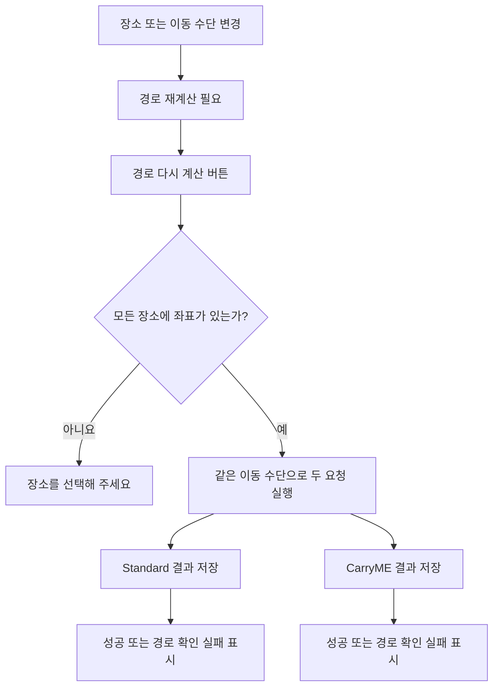

# 웹 장소 편집 및 경로 재계산 설계

## 결론

웹 장소 검색을 Google 자동완성·상세 조회 2단계에서 네이버 장소 검색 1단계로 바꾼다.
검색 후보가 이름·주소·좌표·검색 출처를 함께 반환하므로 사용자가 후보를 선택한 시점에 길안내 가능한 장소가 확정된다.

일정 전체 이동 수단은 자동차(`drive`) 또는 대중교통(`transit`) 하나만 둔다.
사용자가 이동 수단이나 장소를 바꾸면 화면 상태만 `재계산 필요`로 바꾸고, `경로 다시 계산` 버튼을 누를 때 Standard와 CarryME를 같은 이동 수단으로 각각 계산한다.
한쪽 계산이 실패해도 성공한 쪽 결과는 유지하며, 실패한 쪽에 다른 경로를 복제하거나 임의의 직선 경로를 그리지 않는다.

## 현재 문제

- 장소 검색이 Google 자동완성과 상세 조회로 나뉘어 있어 이름만 바뀌고 좌표가 확정되지 않는 중간 상태가 생길 수 있다.
- 자동완성 검색 중심이 오사카 반경 50km로 고정돼 있어 국내 1차 범위와 맞지 않는다.
- 장소명 편집 시 좌표와 `placeId`는 지우지만 기존 검색 출처가 남을 수 있다.
- 이동 수단을 구간별로 선택할 수 있어 일정 전체 이동 수단이 섞일 수 있다.
- 현재 재계산 버튼은 CarryME 중심으로 동작하고, 실패하면 Standard 결과를 CarryME 결과처럼 복제할 수 있다.
- 초기 경로 계산 실패에도 다른 경로의 결과를 대체값으로 사용할 수 있어 실제 공급자 경로선인지 구분하기 어렵다.

## 목표와 비목표

### 목표

- 국내 네이버 장소 검색 결과만 웹 편집 후보로 사용
- 장소 선택과 동시에 좌표·검색 출처 확정
- 일정 전체 이동 수단 하나만 표시·변경
- 이동 수단 변경 후 버튼을 누르기 전까지 경로 호출 금지
- Standard·CarryME를 같은 이동 수단으로 독립 계산
- 부분 실패 시 성공 결과 보존과 실패 결과 명시
- 네이버 또는 ODsay가 반환한 실제 경로선만 지도에 표시

### 비목표

- 자동차와 대중교통 결과 비교 화면
- 구간별 이동 수단 편집
- 사용자 선택용 도보 이동 수단
- Google Places 보조 검색
- 검색 중심 좌표·반경 설정
- 기존 일정 링크의 장소·이동 수단 데이터 변환

## 웹 장소 검색 API

기존 `/api/places/autocomplete`와 `/api/places/details` 대신 좌표를 포함한 후보를 반환하는 서버 API 하나를 사용한다.

```ts
type PlaceSearchRequest = {
  query: string;
  limit?: number;
};

type PlaceSearchCandidate = {
  candidateId: string;
  name: string;
  address?: string;
  category?: string;
  coordinate: MapCoordinate;
  placeSource: "naver_local" | "naver_geocode";
  placeSourceRef: string;
};

type PlaceSearchResponse = {
  candidates: PlaceSearchCandidate[];
};
```

권장 경로는 `GET /api/places/search?query=...`다.
API route가 네이버 인증과 응답 정규화를 담당하고 브라우저는 네이버 원본 응답과 인증 정보를 받지 않는다.

### 입력 검증

- trim한 검색어가 2자 미만이면 외부 검색을 호출하지 않는다.
- `limit`는 서버가 허용 범위로 제한하며 클라이언트 입력을 그대로 네이버 `display`에 전달하지 않는다.
- 빈 결과는 정상 응답의 빈 배열로 반환한다.
- 네이버 오류는 사용자에게 공급자 응답 원문을 노출하지 않고 검색 실패 상태로 변환한다.

### 후보 정규화

- 네이버 지역 검색의 HTML 강조 태그를 서버에서 제거한다.
- `mapx`, `mapy`를 일반 경위도로 바꾼 뒤 유효 범위를 검사한다.
- 지역 검색 결과가 없고 주소형 검색어이면 네이버 주소 좌표 변환 후보를 사용할 수 있다.
- 후보에는 Google `placeId`를 채우지 않는다.
- `candidateId`는 선택 목록 내부 식별자, `placeSourceRef`는 저장·검증 가능한 검색 출처다.

## 장소 편집 상태

표시용 후보 타입을 공급자 중립 이름으로 바꾸고, 선택 결과를 route stop에 직접 기록한다.

```ts
type DestinationCandidate = PlaceSearchCandidate;

type EditableRouteStop = RouteStop & {
  placeSource?: "naver_local" | "naver_geocode" | "input";
  placeSourceRef?: string;
};
```

### 사용자가 장소명을 입력할 때

1. 이름만 입력하고 아직 후보를 선택하지 않은 상태로 바꾼다.
2. 기존 `coordinate`, `placeId`, `placeSource`, `placeSourceRef`를 모두 제거한다.
3. 약 300ms 입력 지연 후 검색한다.
4. 새 검색이 시작되면 이전 요청을 `AbortController`로 취소한다.
5. 키보드 또는 포인터로 후보를 선택할 수 있게 한다.

### 사용자가 후보를 선택할 때

- 후보의 `name`, `address`, `coordinate`, `placeSource`, `placeSourceRef`를 stop에 반영한다.
- 기존 Google `placeId`는 제거한다.
- 해당 일정 종류의 경로 상태를 `dirty`로 바꾼다.
- 검색 목록을 닫고 선택된 장소명을 표시한다.

후보를 선택하지 않고 경로 재계산을 누르면 외부 경로 API를 호출하지 않고 다음 문구를 표시한다.

```text
장소를 선택해 주세요
```

## 일정 전체 이동 수단 상태

```ts
type PlanmeTransportMode = "drive" | "transit";

type ItineraryRouteEditorState = {
  transportMode: PlanmeTransportMode;
  standard: RouteCalculationState;
  carryme: RouteCalculationState;
};
```

- 이동 수단 선택기는 일정 편집 영역에 하나만 둔다.
- 선택지는 `자동차`, `대중교통` 두 개다.
- 각 행선지 row의 이동 수단 선택기는 제거한다.
- 저장 일정의 `transportMode`를 초기 선택값으로 사용한다.
- 사용자가 값을 바꾸면 Standard·CarryME 상태를 모두 `dirty`로 바꾼다.
- 이동 수단 변경만으로 네이버 또는 ODsay 호출을 시작하지 않는다.
- 사용자에게 `도보` 선택지나 대표 이동 수단 문구를 노출하지 않는다.

## Standard·CarryME 경로 데이터 경계

Standard와 CarryME는 서로 다른 행선지 순서와 숙소 경유를 가질 수 있으므로 stop 목록과 계산 결과를 별도로 유지한다.
일정 전체 이동 수단만 두 일정에 공통으로 적용한다.

- Standard는 현재 Standard stop 목록으로 계산한다.
- CarryME는 사용자가 편집한 CarryME stop 목록으로 계산한다.
- 한쪽 장소 편집 결과를 이름만으로 다른 쪽 stop에 자동 복제하지 않는다.
- 두 일정에 같은 `placeSourceRef`를 가진 논리적으로 같은 장소가 명시돼 있을 때만 공통 장소 갱신을 고려할 수 있으나, 1차 구현의 필수 동작은 아니다.
- 사용자 지정 출발지·목적지·복귀지는 생성 단계에서 이미 고정 좌표를 가지므로 두 일정 모두 같은 anchor를 사용한다.

## 경로 재계산 상태 모델

```ts
type RouteCalculationStatus =
  | "idle"
  | "dirty"
  | "checking"
  | "success"
  | "failed";

type RouteCalculationState = {
  status: RouteCalculationStatus;
  result?: RouteCheckResult;
  message?: string;
};
```

### 버튼 동작

1. Standard와 CarryME의 모든 stop 좌표를 검사한다.
2. 선택되지 않은 장소가 하나라도 있으면 두 경로 호출을 시작하지 않고 `장소를 선택해 주세요`를 표시한다.
3. 두 상태를 `checking`으로 바꾼다.
4. 같은 `transportMode`로 Standard·CarryME 요청을 각각 실행한다.
5. `Promise.allSettled`와 같은 독립 결과 처리 방식으로 성공·실패를 분리한다.
6. 성공한 결과의 시간·거리·실제 경로선만 갱신한다.
7. 실패한 결과는 기존 성공 경로를 새 성공처럼 복제하지 않고 `failed`로 바꾼다.



### 부분 실패 표시

실패한 일정 종류에는 다음 문구를 표시한다.

```text
경로를 확인하지 못했습니다
```

- Standard 성공·CarryME 실패: Standard 경로선은 유지하고 CarryME 경로선은 표시하지 않는다.
- Standard 실패·CarryME 성공: CarryME 경로선은 유지하고 Standard 경로선은 표시하지 않는다.
- 둘 다 실패: 두 결과 영역에 각각 실패 상태를 표시한다.
- 공급자 path가 없으면 stop 사이 직선을 실제 길안내 경로처럼 그리지 않는다.

사용자가 말한 `폴리곤`은 지도에서 면을 채우는 polygon이 아니라 실제 도로를 잇는 경로선(polyline)으로 구현·검증한다.

## 이동 수단별 공급자 연결

| 전체 이동 수단 | 공급자 | 지도 표시 기준 |
| --- | --- | --- |
| 자동차(`drive`) | 네이버 Directions | 네이버가 반환한 실제 경로 좌표 |
| 대중교통(`transit`) | ODsay | 대중교통 경로와 공급자 내부 도보 구간 좌표 |

대표 이동 수단은 하나지만 ODsay 내부의 접근·환승 도보 구간은 실제 대중교통 안내에 필요한 세부 구간으로 유지한다.

## 초기 화면 동작

- 신규 일정의 모든 stop에 좌표가 있으면 현재처럼 초기 Standard·CarryME 경로 계산을 수행할 수 있다.
- 초기 계산도 두 결과를 독립 처리하고 한쪽 결과를 다른 쪽에 복제하지 않는다.
- 사용자가 장소나 이동 수단을 바꾼 이후에는 반드시 버튼을 눌러야 다시 계산한다.
- 기존 링크·좌표 없는 기존 데이터에 대한 보정 화면은 만들지 않는다.

## 접근성

- 전체 이동 수단 선택기에 화면 표시 이름을 연결한다.
- 장소 후보 목록은 키보드 위·아래 이동, 선택, 닫기를 지원한다.
- 검색 중, 검색 실패, 경로 계산 중, 부분 실패 상태를 보조 기술이 읽을 수 있는 상태 영역에 알린다.
- 색상만으로 `dirty`, `success`, `failed`를 구분하지 않는다.

## 대안과 기각 이유

### 네이버 자동완성 후 별도 상세 조회

기각한다. 네이버 지역 검색 결과에 좌표가 포함되므로 별도 상세 호출은 좌표 없는 중간 상태와 오류 지점만 늘린다.

### 이동 수단 변경 즉시 경로 계산

기각한다. 사용자가 장소와 이동 수단을 연속 편집할 때 불필요한 외부 API 호출이 발생한다.

### CarryME 실패 시 Standard 경로 복제

기각한다. 서로 다른 행선지 순서의 경로를 성공 결과처럼 보이게 한다.

### 공급자 경로 실패 시 stop 직선 연결

기각한다. 실제 도로·대중교통 길안내로 오해될 수 있다.

## 리스크

- 네이버 지역 검색에는 Google 세션 토큰과 같은 자동완성 과금 최적화 모델이 없어 입력 지연·취소·최소 글자 수가 중요하다.
- 이름만 같은 장소를 Standard와 CarryME 사이에 자동 동기화하면 서로 다른 지점을 잘못 합칠 수 있다.
- 경로선이 없는 ODsay 응답을 직선으로 보완하지 않으면 일부 대중교통 결과는 지도선 없이 텍스트만 표시될 수 있다.
- 초기 자동 계산과 버튼 재계산이 서로 다른 상태 코드를 쓰면 fallback 회귀가 남을 수 있으므로 공통 계산 함수를 사용해야 한다.

## 검증 연결

- 오사카 중심·Google 자동완성·상세 조회 코드 미사용 확인
- 검색 후보 선택 즉시 좌표·출처 반영 확인
- 자유 입력 후 기존 좌표·출처 전체 제거 확인
- 약 300ms 입력 지연과 이전 요청 취소 확인
- 이동 수단 선택기 하나, 자동차·대중교통만 노출 확인
- 이동 수단 변경만으로 외부 경로 호출이 없는지 확인
- 버튼 클릭 시 두 일정이 같은 이동 수단으로 계산되는지 확인
- 한쪽 실패 시 다른 쪽 성공 결과가 보존되는지 확인
- 실패 시 복제 경로·직선 경로선이 표시되지 않는지 확인
