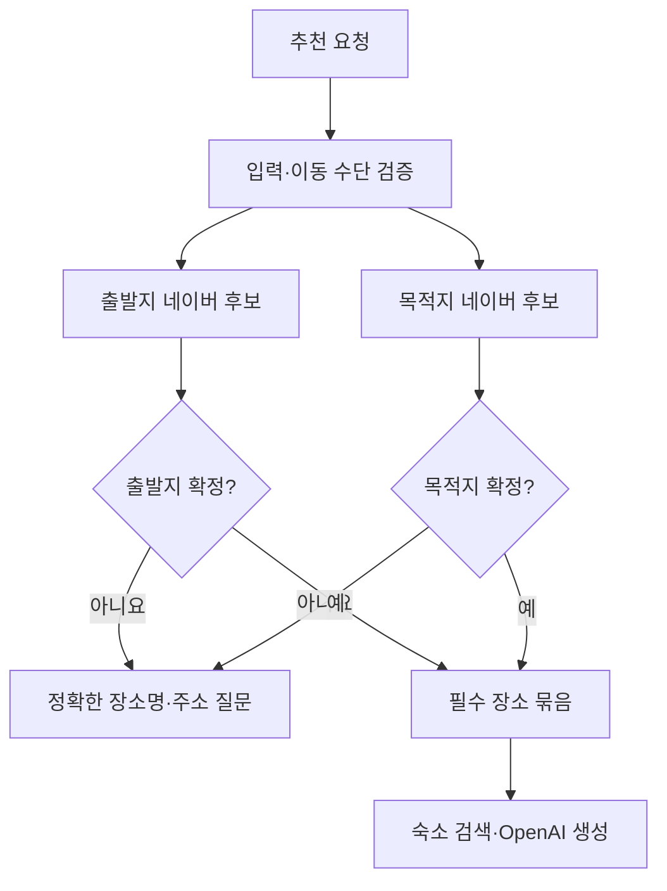

# Core 장소 좌표 및 이동 수단 구현계획

## 결론

Core에는 `사용자 입력을 확인하는 필수 장소 단계`, `AI가 만드는 중간 장소 단계`, `최종 저장 hard gate`를 분리해 구현한다.
출발지·사용자 목적지는 OpenAI 일정 생성 전에 네이버 후보로 확정하며 `requiredPlaceKind`로 추적한다.
AI는 네이버 장소 검색 함수로 중간 장소를 고를 수 있지만 최종 좌표·검색 출처의 유효성은 코드가 검사한다.

이동 수단은 자동차(`drive`) 또는 대중교통(`transit`)인 일정 전체 값 하나다.
준비 요청에서는 생략 가능하지만 추천 요청·AI 초안 정규화·저장 일정에서는 필수다.
AI stop별 `mode`는 원본 값이 아니며 코드가 일정 전체 값으로 덮어쓴다.

## 현재 코드와 충돌

| 현재 코드 | 문제 | 구현 방향 |
| --- | --- | --- |
| `GeneratedItineraryRequest`에 이동 수단 없음 | 추천 단계가 사용자 선택 없이 실행 가능 | Core 공통 타입 추가, 추천 요청에서는 required |
| `PlanmeDraftPreviewRequest`, `PlanmeItinerary`에 이동 수단 없음 | 웹이 첫 stop mode로 추정해야 함 | top-level `transportMode` 저장 |
| AI schema가 모든 stop에 `mode` 요구 | 모델이 구간별로 다른 mode 생성 가능 | AI 독립 결정 제거, 코드 주입 |
| `resolveDraftPlaceCandidatesIfPossible`이 모든 stop을 같은 문맥으로 검색 | 출발지가 목적지 지역 후보로 오판 가능 | 필수 장소를 생성 전에 별도 해석 |
| Google 텍스트·주변 검색과 반경 ladder | 네이버 단일 검색 결정과 충돌 | 네이버 텍스트·주소 후보만 유지 |
| 중간 장소 미확정도 `needs_clarification` | 사용자에게 AI 내부 실패 노출 | 최대 2회 대체 후 제외 |
| OpenAI 도구 전체 반복 상한 3회 | 여러 stop의 장소별 2회 대체를 보장하지 못함 | 생성 도구 반복과 후처리 시도 카운터 분리 |
| 별도 Google 숙소 검색 | 신규 장소 공급자가 섞임 | 공통 네이버 후보에서 숙소 필터 |

## 공통 타입

후보:

```ts
export type PlanmeTransportMode = "drive" | "transit";

export type PlanmeRequiredPlaceKind = "origin" | "destination";

export type PlanmePlaceCandidateSource =
  | "naver_local"
  | "naver_geocode"
  | "input";
```

`ProviderSegmentMode`의 내부 `walk`는 유지한다.
`PlanmeTransportMode`, `PlanmeRowMode`는 같은 값 집합을 나타내므로 새 타입을 기준으로 통합하거나 `PlanmeRowMode = PlanmeTransportMode` 별칭으로 둔다.

## DTO 필드 매트릭스

| 출처 | 업무 필드 | DTO 필드 | 방향 | 타입 | Request 필수 | Response 필수 | Nullable | 생략 가능 | 기본값·빈 값 | 근거 | 상태 |
| --- | --- | --- | --- | --- | --- | --- | --- | --- | --- | --- | --- |
| 사용자 대화 | 목적지 | `destination` | 준비 요청·추천 요청 | string | 준비: 아니요, 추천: 예 | 정규화: 예 | 준비 결과만 null | 준비 요청만 가능 | 빈 문자열은 누락 | 인터뷰·기존 계약 | confirmed |
| 사용자 대화 | 출발지 | `origin` | 준비 요청·추천 요청 | string | 준비: 아니요, 추천: 조건부 | 정규화: 예 | 준비 결과만 null | `arrivalAirport`가 있으면 가능 | 빈 문자열은 누락 | 기존 공항 계약 | confirmed |
| 사용자 대화 | 여행 일수 | `durationDays` | 준비 요청·추천 요청 | integer 1~14 | 준비: 아니요, 추천: 예 | 정규화: 예 | 준비 결과만 null | 준비 요청만 가능 | 기본값 없음 | 기존 계약 | confirmed |
| 사용자 선택 | 일정 전체 이동 수단 | `transportMode` | 준비 요청·추천 요청·응답 | `drive` 또는 `transit` | 준비: 아니요, 추천: 예 | 정규화·일정: 예 | 준비 결과만 null | 준비 요청만 가능 | 기본값 없음 | 인터뷰 | confirmed |
| 사용자 입력 | 숙소명 | `hotelName` | 요청 | string | 아니요 | 정규화: 예 | 정규화 결과 null | 예 | 빈 문자열은 null | 기존 계약 | confirmed |
| 사용자 입력 | 취향 | `preferences` | 요청 | string[] | 아니요 | 정규화: 예 | 아니요 | 예 | 빈 배열 | 기존 계약 | confirmed |
| 시스템 확인 | 필수 장소 종류 | `requiredPlaceKind` | 내부 anchor·AI 초안 stop | `origin`, `destination`, null | AI schema: 예 | 저장 stop: 필요 시 | AI schema에서 null 허용 | Core draft 타입은 선택 가능 | 중간 장소는 없음 | 설계 | confirmed |
| 공급자 결과 | 좌표 | `coordinate` | 후보·최종 stop | `{lat,lng}` | 후보: 예 | 최종 stop: 예 | 아니요 | AI 초안에서만 가능 | 기본값 없음 | 길안내 hard gate | confirmed |
| 공급자 결과 | 검색 출처 | `placeSource` | 후보·최종 stop | source enum | 후보: 예 | 최종 stop: 예 | 아니요 | AI 초안에서만 가능 | 기본값 없음 | 좌표 신뢰 근거 | confirmed |
| 공급자 결과 | 검색 출처 참조 | `placeSourceRef` | 후보·최종 stop | string | 후보: 예 | 최종 stop: 예 | 아니요 | AI 초안에서만 가능 | 빈 문자열 금지 | hard gate | confirmed |
| 공급자 결과 | Google ID | `placeId` | legacy stop | string | 아니요 | 아니요 | 아니요 | 예 | 신규 네이버 후보에는 미설정 | 네이버 단일 공급자 | excluded |

## 준비 요청과 추천 요청

후보:

```ts
export type PlanmePlanningRequest = {
  message?: string;
  destination?: string;
  origin?: string;
  arrivalAirport?: string;
  durationDays?: number;
  transportMode?: PlanmeTransportMode;
  hotelName?: string;
  preferences?: string[];
};

export type RecommendItineraryRequest = GeneratedItineraryRequest & {
  transportMode: PlanmeTransportMode;
  // 기존 preview·clarification 필드 유지
};
```

`RecommendItineraryRequest`의 실제 런타임 조건:

- `destination`, `durationDays`, `transportMode`는 필수다.
- `origin`, `arrivalAirport` 중 하나는 필요하다.
- `transportMode`가 없거나 다른 값이면 OpenAI·네이버 호출 전에 실패한다.
- 서버는 자연어 `자차`, `택시`, `KTX`를 직접 분류하지 않는다.

## 준비 질문 구현

`PlanmePlanningSlot`과 `normalizedInput`에 이동 수단을 추가한다.

예시:

```ts
const TRANSPORT_MODE_QUESTION: PlanmePlanningQuestion = {
  slot: "transportMode",
  text: "일정 안내는 자동차와 대중교통만 지원합니다. 어떤 이동 수단으로 안내할까요?",
  required: true,
  examples: ["자동차", "대중교통"],
};
```

질문 순서:

1. 목적지
2. 출발지 또는 도착 공항
3. 여행 일수
4. 일정 전체 이동 수단
5. 숙소·취향 같은 선택 질문

이미 `transportMode`가 있으면 다시 묻지 않는다.

## 네이버 장소 후보 구현

### 공식 공급자 계약

- 공급자 URL: `https://openapi.naver.com/v1/search/local.json`
- 공급자 method: `GET`
- 필수 query: `query`
- 선택 query: `display`, `start`, `sort`
- `display` 공식 최댓값: 5
- 인증 header: `X-Naver-Client-Id`, `X-Naver-Client-Secret`
- 결과 좌표: WGS84 정수 표현의 `mapx`, `mapy`

PlanME 웹 내부 API의 `POST` 결정과 공급자 `GET` 계약을 혼동하지 않는다.

### 후보 타입

후보:

```ts
export type PlanmePlaceCandidate = {
  candidateId: string;
  name: string;
  address?: string;
  category?: string;
  coordinate: MapCoordinate;
  query: string;
  source: "naver_local" | "naver_geocode";
  sourceRef: string;
};

export type PlanmePlaceCandidateSearchInput = {
  query: string;
  region?: string;
  userIntent?: string;
  maxCandidates?: number;
};
```

`center`, `radiusMeters`, `searchMode`, Google `placeId`, Google type 배열은 신규 후보 계약에서 제거한다.

### 지역 검색 정규화

후보 코드 예시:

```ts
function normalizeNaverLocalCoordinate(mapx: string, mapy: string): MapCoordinate | null {
  const lng = Number(mapx) / 10_000_000;
  const lat = Number(mapy) / 10_000_000;

  if (!Number.isFinite(lat) || !Number.isFinite(lng)) {
    return null;
  }

  if (lat < -90 || lat > 90 || lng < -180 || lng > 180) {
    return null;
  }

  return { lat, lng };
}
```

정규화 순서:

1. `<b>` 등 장소명 강조 HTML을 제거한다.
2. 도로명 주소를 우선하고 없으면 지번 주소를 사용한다.
3. `mapx`를 경도, `mapy`를 위도로 변환한다.
4. 좌표 범위가 잘못된 후보를 버린다.
5. 같은 출처 참조 또는 같은 주소·좌표 후보를 중복 제거한다.
6. 결과를 최대 5개까지만 반환한다.

`sourceRef`에는 인증값과 검색어 원문을 넣지 않는다.
공급자 종류, 정규화 주소 또는 링크, 좌표로 재현 가능한 값을 만든다.

### 주소 좌표 변환 결합

현재 `createNaverGeocoder`는 첫 주소만 반환한다.
필수 장소 해석에서는 지역 검색 후보와 주소 좌표 변환 후보를 공통 타입으로 모아 판단할 수 있게 adapter를 추가한다.

- `경주월드` 같은 상호·관광지는 지역 검색 우선
- `동탄` 같은 넓은 행정구역·주소형 입력은 주소 좌표 변환 후보를 함께 검토
- 지역 검색이 비어도 주소 후보가 유효하면 선택 가능
- 두 공급자 후보가 모두 없으면 필수 장소 실패

고정된 `동탄` 좌표를 코드 상수로 추가하지 않는다.

## 필수 장소 선검증

후보:

```ts
type PlanmeResolvedRequiredPlace = {
  kind: PlanmeRequiredPlaceKind;
  inputText: string;
  name: string;
  address?: string;
  coordinate: MapCoordinate;
  source: "naver_local" | "naver_geocode";
  sourceRef: string;
};

type PlanmeResolvedRequiredPlaces = {
  origin: PlanmeResolvedRequiredPlace;
  destination: PlanmeResolvedRequiredPlace;
};
```

처리 흐름:



중요 규칙:

- 출발지 후보 검색에 `input.destination`을 지역 prefix로 넣지 않는다.
- 목적지 후보 검색은 사용자 목적지 문자열 자체와 필요한 지역 맥락만 사용한다.
- 두 검색은 동시에 실행할 수 있지만 결과와 오류는 `origin`, `destination`으로 구분한다.
- 후보가 하나라고 무조건 확정하지 않고 hard gate와 입력 적합성을 검사한다.
- 필수 장소가 실패하면 중간 장소 로직으로 보내지 않는다.
- 사용자 지정 목적지는 AI가 순서와 날짜를 정할 수 있지만 장소 자체를 바꿀 수 없다.

## OpenAI 장소 함수

기존 `search_places_text`, `search_places_nearby` 대신 하나만 노출한다.

후보:

```ts
{
  type: "function",
  name: "search_naver_places",
  description: "Search verified Korean Naver place candidates with coordinates.",
  strict: true,
  parameters: {
    type: "object",
    additionalProperties: false,
    required: ["query", "region", "userIntent", "maxCandidates"],
    properties: {
      query: { type: "string" },
      region: { type: ["string", "null"] },
      userIntent: { type: ["string", "null"] },
      maxCandidates: { type: ["integer", "null"], minimum: 1, maximum: 5 },
    },
  },
}
```

- 엄격한 함수 schema에서는 optional 의미의 필드도 `required`에 넣고 `null`을 허용한다.
- `query`는 실제 장소 검색에 필요하므로 null을 허용하지 않는다.
- 함수 결과는 최대 5개 후보와 실제 검색된 query 목록만 돌려준다.
- 공급자 인증·원본 오류·전체 응답을 함수 결과에 넣지 않는다.
- 함수가 반환하지 않은 좌표를 모델이 작성해도 최종 hard gate에서 신뢰하지 않는다.

## AI 초안 schema와 이동 수단

`PlanmeDraftPreviewRequest`와 `PlanmeItinerary`에 필수 전체 이동 수단을 추가한다.

후보:

```ts
export type PlanmeDraftPreviewRequest = {
  transportMode: PlanmeTransportMode;
  // 기존 필드
};

export type PlanmeItinerary = {
  transportMode: PlanmeTransportMode;
  // 기존 필드
};
```

AI stop schema에는 `requiredPlaceKind`를 추가하고 `mode`는 제거하는 방향을 우선한다.
기존 렌더링 타입의 stop `mode`는 저장 전 정규화 과정에서 채운다.

예시:

```ts
function applyTransportModeToDraft(
  draft: PlanmeDraftPreviewRequest,
  transportMode: PlanmeTransportMode,
): PlanmeDraftPreviewRequest {
  return {
    ...draft,
    transportMode,
    days: draft.days.map((day) => ({
      ...day,
      standardStops: day.standardStops?.map((stop) => ({ ...stop, mode: transportMode })),
      carrymeStops: day.carrymeStops?.map((stop) => ({ ...stop, mode: transportMode })),
      stops: day.stops?.map((stop) => ({ ...stop, mode: transportMode })),
    })),
  };
}
```

AI prompt에는 다음 사실을 포함한다.

- 선검증 출발지와 목적지의 이름·주소·좌표·출처
- 목적지는 반드시 Standard·CarryME에 포함
- 첫 stop과 마지막 복귀 stop은 출발지 anchor
- 일정 전체 이동 수단
- 실제 함수 후보 없이 장소 좌표를 추정하지 말 것

## 필수 장소 주입과 교정

초안을 받은 뒤 이름 비교가 아니라 `requiredPlaceKind`로 anchor를 주입한다.

- 첫날 `origin`: 선검증 출발지
- 사용자 목적지 `destination`: 선검증 목적지
- 마지막 날 복귀 `origin` + 경로 역할 `복귀지`: 선검증 출발지
- 모든 anchor stop의 이름·주소·좌표·출처를 코드 값으로 덮어쓴다.

사용자 목적지 참조가 없으면 AI 초안 교정을 한 번만 실행한다.
교정 요청은 새 장소 검색이 아니라 누락된 필수 장소를 기존 일정에 배치하는 작업이다.
교정 후에도 목적지가 없으면 저장하지 않고 필수 장소 계약 실패로 반환한다.

## 중간 장소 최대 2회 대체

장소별 시도는 OpenAI 생성 응답의 전역 함수 호출 반복 횟수와 분리한다.

후보:

```ts
const MAX_INTERMEDIATE_REPLACEMENT_ATTEMPTS = 2;

async function resolveIntermediateStop(
  stop: PlanmeDraftRouteStop,
  context: IntermediatePlaceResolutionContext,
): Promise<ResolvedIntermediateStop | null> {
  const direct = await searchAndDecideCandidate(stop.addressQuery ?? stop.name, context);

  if (direct) {
    return direct;
  }

  for (let attempt = 1; attempt <= MAX_INTERMEDIATE_REPLACEMENT_ATTEMPTS; attempt += 1) {
    const replacementQuery = await suggestReplacementQuery(stop, context, attempt);
    const replacement = await searchAndDecideCandidate(replacementQuery, context);

    if (replacement) {
      return replacement;
    }
  }

  return null;
}
```

시도 의미:

- 직접 검색은 원래 AI 장소 검증이다.
- 대체 시도 1·2는 AI가 같은 지역·주제·장소 종류를 유지한 새 검색어를 만드는 횟수다.
- 공급자 429·5xx 네트워크 재시도는 대체 시도 횟수에 포함하지 않는다.
- 중간 장소별 카운터를 사용한다.
- 한 장소의 실패가 다른 장소의 대체 기회를 소비하지 않는다.

대체 실패 시:

1. Standard·CarryME·legacy stop 목록에서 같은 논리 장소를 제외한다.
2. 관련 timeline event를 제외한다.
3. route text와 설명에서 장소명을 제거한다.
4. 사용자 응답에 내부 시도 내역을 노출하지 않는다.
5. resolution log에는 원래 이름, attempt, `excluded`만 남긴다.

## 숙소 처리

`accommodation-candidates.ts`는 독립 공급자 client 역할을 끝낸다.

- 사용자가 숙소명을 주면 그 문자열을 네이버 후보로 검증한다.
- 숙소가 없으면 AI가 지역·선호 기반 검색어를 만든다.
- 공통 네이버 후보 중 이름 또는 category가 숙소성 패턴과 일치하는 후보만 사용한다.
- rating과 리뷰 수는 네이버 지역 검색 계약에 없으므로 새 DTO에서 제거한다.
- 숙소도 중간 장소와 같은 최대 2회 대체·제외 정책을 사용한다.

## 최종 hard gate

후보:

```ts
function hasFinalStopHardGate(stop: PlanmeDraftRouteStop): boolean {
  return (
    Number.isFinite(stop.coordinate?.lat) &&
    Number.isFinite(stop.coordinate?.lng) &&
    (stop.coordinate?.lat ?? 0) >= -90 &&
    (stop.coordinate?.lat ?? 0) <= 90 &&
    (stop.coordinate?.lng ?? 0) >= -180 &&
    (stop.coordinate?.lng ?? 0) <= 180 &&
    Boolean(stop.placeSource) &&
    Boolean(stop.placeSourceRef?.trim())
  );
}
```

추가 일정 gate:

- Standard·CarryME 모두 사용자 목적지 anchor가 있다.
- 첫날 출발지와 마지막 날 복귀지가 출발지 anchor와 일치한다.
- 저장 일정 `transportMode`가 있다.
- 모든 대표 stop `mode`가 저장 일정 전체 이동 수단과 같다.
- 좌표 없는 중간 장소가 제거됐다.

gate 실패 시 `persistItineraryForDetailPage`를 호출하지 않는다.

## MCP 도구 계약

### 일정 준비 도구

| 필드 | 필수 | nullable | 생략 | 기본값 |
| --- | --- | --- | --- | --- |
| `destination` | 아니요 | 아니요 | 가능 | 없음 |
| `origin` | 아니요 | 아니요 | 가능 | 없음 |
| `arrivalAirport` | 아니요 | 아니요 | 가능 | 없음 |
| `durationDays` | 아니요 | 아니요 | 가능 | 없음 |
| `transportMode` | 아니요 | 아니요 | 가능 | 없음 |
| `preferences` | 아니요 | 아니요 | 가능 | 빈 배열로 정규화 |

누락은 준비 응답의 `normalizedInput.transportMode: null`로 표현한다.

### 일정 추천 도구

| 필드 | 필수 | nullable | 생략 | 기본값 |
| --- | --- | --- | --- | --- |
| `destination` | 예 | 아니요 | 불가 | 없음 |
| `durationDays` | 예 | 아니요 | 불가 | 없음 |
| `transportMode` | 예 | 아니요 | 불가 | 없음 |
| `origin` | 조건부 | 아니요 | 공항이 있으면 가능 | 없음 |
| `arrivalAirport` | 조건부 | 아니요 | 출발지가 있으면 가능 | 없음 |
| `hotelName` | 아니요 | 아니요 | 가능 | 없음 |
| `preferences` | 아니요 | 아니요 | 가능 | 빈 배열 |

MCP Zod schema에서 `walk`, 빈 문자열, 범위 밖 일수를 거부한다.

## GPTs Actions REST·OpenAPI

현재 REST handler는 JSON을 타입 단언한 뒤 Core에 넘긴다.
MCP와 같은 런타임 검증 schema를 사용하거나 최소한 동등한 Zod schema로 parse한다.

| 작업 | Method | Path | Request | Response | 상태 코드 | 권한 | 기존 관례 |
| --- | --- | --- | --- | --- | --- | --- | --- |
| 준비 확인 | POST | `/api/gpt/planning/start` | `PlanmePlanningRequest` | `PlanmePlanningAssessment` | 200, 400, 405 | 공개 GPT Action | 기존 path 유지 |
| 일정 추천 | POST | `/api/gpt/itineraries/recommend` | `RecommendItineraryRequest` | ready 또는 clarification | 200, 400, 405, 500 | 공개 GPT Action | 기존 path 유지 |

REST 오류:

- JSON 파싱 실패·schema 오류: 400
- method 불일치: 405
- 필수 장소 미확정: 200 clarification 계약 유지
- OpenAI 설정 누락: 기존 500 오류 코드 유지
- 네이버 필수 장소 공급자 장애: 일반 추천 실패로 숨기지 말고 내부 오류 코드와 안전한 사용자 문구로 변환

OpenAPI 변경:

- 모든 이동 수단 enum에 `drive`, `transit`만 사용
- `PlanmePlanningAssessment.missingSlots`에 `transportMode`
- `PlanmePlanningQuestion.slot`에 `transportMode`
- `NormalizedPlanningInput.transportMode` required + nullable
- 추천 request required에 `destination`, `durationDays`, `transportMode`
- `origin` 또는 `arrivalAirport` 조건을 `anyOf`로 명시
- 목적지 설명을 도시·지역·실제 장소로 확장
- 응답 itinerary에 전체 이동 수단 포함

## 사용량 이벤트와 로그

`PlanmeUsageCounterEvent` 후보:

```ts
type PlanmeUsageCounterEvent =
  | "openai_request"
  | "function_place_search_call"
  | "naver_local_search_request"
  | "naver_geocode_request"
  | "naver_directions_request"
  | "odsay_request"
  | "itinerary_ready"
  | "needs_clarification"
  | "hard_gate_failed";
```

`google_places_request`는 신규 코드와 테스트에서 제거한다.
검색어·상세 주소·인증값·공급자 원본 응답은 사용량 로그에 넣지 않는다.

장소 해석 로그 후보:

```ts
type PlanmePlaceResolutionLog = {
  originalName: string;
  attempt: 0 | 1 | 2;
  outcome: "kept" | "replaced" | "excluded" | "required_place_failed";
  resolvedName?: string;
  source?: PlanmePlaceCandidateSource;
  sourceRef?: string;
};
```

기존 `decisionStatus`, `radiusMeters`, Google 기본 source를 제거하거나 새 정책과 호환되게 변환한다.

## 테스트 추가·변경

`apps/mcp/scripts/check-planme-mcp.ts`에 다음 모의 검증을 추가한다.

- 준비 요청 이동 수단 누락·명시
- 추천 요청 이동 수단 누락·`walk` 거부
- MCP·REST OpenAPI enum과 required 일치
- 네이버 지역 검색 요청 header·display=5
- HTML 장소명·WGS84 좌표 정규화
- 출발지와 목적지 후보 호출 문맥 분리
- 사용자 목적지 누락 1회 교정
- 중간 장소 대체 1회·2회 성공
- 중간 장소 2회 실패 후 양쪽 제외
- 필수 장소 실패 시 link 저장 미호출
- 모든 stop mode가 top-level mode와 일치
- Google Places·nearby 호출 0회

기존 `createMockGooglePlaceCandidate` fixture는 네이버 후보 fixture로 바꾼다.
기존 Google·반경 상수 assertion은 삭제가 아니라 네이버 단일 계약 assertion으로 교체한다.

## 구현 중단 조건

- 사용자 확정 변수인 `NAVER_MAPS_CLIENT_ID`, `NAVER_MAPS_CLIENT_SECRET`으로 지역 검색 인증이 실패한다.
- 출발지·목적지 선검증보다 기존 draft 전체 geocoding이 먼저 실행된다.
- AI가 작성한 좌표나 stop mode가 코드 검증 없이 저장된다.
- 여러 중간 장소가 하나의 전역 2회 카운터를 공유한다.
- 제외된 장소명이 타임라인·route text에 남는다.
- MCP와 REST 중 한쪽만 새 이동 수단 계약을 가진다.
- 테스트 편의를 위해 자동차를 누락 기본값으로 넣는다.
