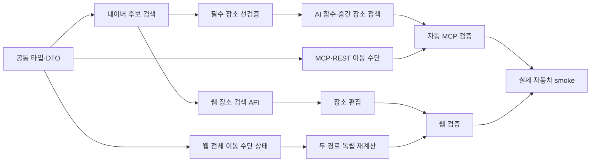

# 전체 구현 순서

## 결론

구현은 `공통 타입과 계약 → 네이버 장소 검색 → 필수 장소와 AI 일정 → 이동 수단 정규화 → 웹 편집과 경로 계산 → 자동·실제 검증` 순서로 진행한다.
웹부터 바꾸면 저장 일정에 전체 이동 수단과 검색 출처가 없고, AI부터 바꾸면 MCP·REST 스키마가 새 필드를 전달하지 못하므로 Core 계약을 먼저 고정해야 한다.

완료 기준은 신규 일정의 모든 남은 장소가 좌표와 검색 출처를 가지고, 사용자 지정 출발지·목적지를 보존하며, 선택한 일정 전체 이동 수단이 현재 날짜의 Standard·CarryME 두 공급자 요청에 동일하게 적용되는 것이다.

## 범위

### 포함

- 자동차(`drive`)·대중교통(`transit`) 일정 전체 이동 수단 타입과 저장
- 이동 수단 누락 시 MCP 준비 질문
- 네이버 지역 검색·주소 좌표 변환 공통 후보 정규화
- 출발지·사용자 목적지 AI 생성 전 선검증
- OpenAI의 네이버 장소 검색 함수 호출
- 중간 행선지·숙소 최대 2회 대체 후 제외
- 신규 일정 최종 좌표·출처 hard gate
- 웹 네이버 장소 검색 단일 API
- 웹의 구간별 이동 수단 선택기 제거
- 선택한 날짜의 Standard·CarryME 독립 경로 재계산
- 실제 네이버 자동차 일정 검증

### 제외

- 기존 일정 링크와 저장 데이터 보정
- DB 스키마·마이그레이션
- 해외 장소 검색
- 네이버 실패 시 Google fallback
- 실제 ODsay 대중교통 호출
- 자동차·대중교통 비교 UI
- 한 번의 버튼으로 모든 날짜 일괄 재계산
- 배포와 Linear 변경

## 구현 단계

### 0단계: 런타임·baseline 준비

목적은 새 코드 실패와 기존 환경 실패를 분리하는 것이다.

1. 현재 저장소 루트, detached branch 여부, dirty 파일을 기록한다.
2. 원본 체크아웃에서 필요한 gitignored 런타임 파일을 민감값 출력 없이 현재 worktree에 준비한다.
3. 변수 값은 출력하지 않고 다음 인증 그룹의 존재 여부와 실제 코드 사용 이름만 확인한다.
   - OpenAI
   - NAVER Developers 지역 검색
   - Naver Cloud Maps 주소 좌표 변환·Directions
   - 네이버 Dynamic Map 공개 식별자
   - ODsay
   - 상세 링크 저장소
4. 현재 `npm run test:actions`, `npm run test:mcp`, Core build, MCP typecheck, Web build 결과를 baseline으로 기록한다.
5. 로컬 MCP `8787` 포트가 다른 worktree 프로세스에 점유됐는지 확인한다.

중단 조건:

- 기존 문서 외 사용자 변경과 구현 예정 파일이 겹친다.
- 사용자 확정 변수인 `NAVER_MAPS_CLIENT_ID`, `NAVER_MAPS_CLIENT_SECRET`으로 지역 검색 인증이 실패한다.
- baseline 실패 원인이 구현 범위와 무관하고 새 변경의 검증을 방해한다.

### 1단계: 공통 타입과 DTO 계약

1. 일정 전체 이동 수단(`PlanmeTransportMode`)을 Core 단일 타입으로 둔다.
2. 신규 추천 요청과 저장 일정에 이동 수단을 필수로 추가한다.
3. 일정 준비 요청에서는 이동 수단을 선택 입력으로 받고, 정규화 결과에서는 `null`로 누락을 표현한다.
4. 장소 검색 출처를 네이버 지역 검색·주소 좌표 변환·입력값으로 제한한다.
5. 필수 장소 종류(`origin`, `destination`)를 경로 역할과 분리한다.
6. AI 초안·저장 일정·GPT 응답에서 같은 필드 이름을 사용한다.

검증 게이트:

- Core build가 통과한다.
- 기존 고정 demo fixture에는 테스트용 이동 수단을 명시하지만 신규 사용자 요청의 기본값으로 사용하지 않는다.
- 신규 일정 요청에서 이동 수단을 생략하면 생성 함수에 진입하지 않는다.

### 2단계: 네이버 장소 검색 기반

1. `place-candidates.ts`를 공급자 중립 도메인 모델과 네이버 전용 검색 구현으로 바꾼다.
2. 지역 검색 결과의 HTML 태그, 주소, 분류, 정수형 WGS84 좌표를 정규화한다.
3. 공식 한도에 맞춰 후보 수를 최대 5개로 제한한다.
4. 주소 좌표 변환 후보를 같은 장소 후보 타입으로 변환한다.
5. 기존 Google 텍스트·주변 검색 코드와 반경 상수를 제거한다.
6. 숙소 후보는 별도 Google 호출 대신 공통 네이버 후보에서 숙소성 이름·분류를 필터링한다.
7. 사용량 이벤트를 Google에서 네이버 지역 검색으로 교체한다.

검증 게이트:

- 공급자 mock으로 요청 URL·헤더명·후보 제한을 검증한다.
- `mapx`, `mapy` 정규화와 좌표 범위 검증이 통과한다.
- Google URL·키·주변 검색 함수가 신규 일정 경로에서 참조되지 않는다.

### 3단계: 필수 장소와 AI 일정 생성

1. 추천 요청을 받은 직후 출발지와 사용자 목적지를 각각 네이버로 선검증한다.
2. 두 장소가 모두 확정된 경우에만 숙소 검색과 OpenAI 일정 생성을 시작한다.
3. 확정한 장소를 `requiredPlaceKind`와 좌표·출처를 가진 내부 anchor로 만든다.
4. OpenAI에는 네이버 텍스트 검색 함수 하나만 노출한다.
5. AI 초안에 필수 장소 참조와 전체 이동 수단을 작성하도록 요청한다.
6. 코드가 필수 장소 좌표와 모든 stop 이동 수단을 다시 주입한다.
7. AI가 사용자 목적지를 누락하면 한 번만 초안 교정을 요청한다.
8. 중간 장소는 원래 검색 후 AI 대체 검색어로 최대 2회 찾고, 실패하면 양쪽 stop·타임라인·경로 문구에서 제외한다.
9. 필수 장소는 교체·제외하지 않고 사용자 clarification으로 전환한다.

검증 게이트:

- 출발지를 목적지 지역 검색 문맥으로 검증하지 않는다.
- 사용자 목적지와 출발·복귀 anchor가 Standard·CarryME 양쪽에 남는다.
- 중간 장소 실패가 사용자 질문으로 노출되지 않는다.
- 최종 hard gate 실패 시 링크 저장 함수가 호출되지 않는다.

### 4단계: MCP·GPTs Actions 계약

1. 준비 도구에 optional 이동 수단을 추가한다.
2. 추천 도구에 required 이동 수단을 추가한다.
3. 누락 질문 문구와 두 예시를 확정 문구로 추가한다.
4. MCP Zod schema, Core 타입, GPTs Actions REST/OpenAPI를 같은 커밋 단위에서 맞춘다.
5. REST 입력도 타입 단언만 하지 않고 런타임 검증을 거쳐 잘못된 값에 400을 반환한다.
6. 목적지 설명을 도시·지역 전용에서 사용자 지정 장소까지 확장한다.
7. 응답 일정과 입력 echo에 이동 수단을 포함한다.

검증 게이트:

- MCP 목록·호출 테스트와 REST OpenAPI 계약 테스트가 통과한다.
- 이동 수단 없는 추천 요청은 OpenAI·네이버 호출 전에 거부된다.
- `walk`는 사용자 요청 enum에 없다.

### 5단계: 웹 장소 검색과 경로 상태

1. `POST /api/places/search`를 추가한다.
2. 기존 Google 자동완성·상세 조회 route를 제거한다.
3. 장소 후보 선택 한 번으로 좌표·출처를 row에 저장한다.
4. 자유 입력 시 기존 좌표·Google ID·검색 출처를 모두 제거한다.
5. 약 300ms 입력 지연과 이전 요청 취소를 적용한다.
6. 일정 전체 이동 수단 상태를 Dashboard 상위로 올리고 구간별 선택기를 제거한다.
7. 이동 수단 변경 시 모든 날짜를 재계산 필요로 표시하고 기존 경로선을 성공 결과처럼 유지하지 않는다.
8. 사용자가 선택한 날짜에서 버튼을 누르면 Standard·CarryME를 같은 이동 수단으로 각각 계산한다.
9. 두 결과를 독립 반영하고 다른 경로 복제 fallback을 제거한다.

검증 게이트:

- 이동 수단 변경과 장소 입력만으로 공급자 경로 호출이 발생하지 않는다.
- 선택하지 않은 장소가 있으면 `장소를 선택해 주세요`만 표시한다.
- 한쪽 실패 시 성공한 경로만 실제 경로선으로 표시한다.

### 6단계: 자동·실제 검증

1. 계약·Core build·MCP typecheck·Web build를 통과시킨다.
2. 웹 자동화에서 네이버 장소 검색, 단일 이동 수단, 두 경로 부분 실패를 검증한다.
3. 실제 외부 호출 전에 예상 범위를 알리고 승인 여부를 확인한다.
4. 현재 worktree MCP와 Web을 새로 시작한다.
5. `동탄 → 경주월드 → 동탄, 1박 2일, 자동차`를 MCP로 생성한다.
6. 생성된 상세 화면을 Edge 또는 앱 내 브라우저에서 확인한다.
7. 선택한 날짜의 Standard·CarryME가 네이버 실제 도로 경로선을 각각 표시하는지 확인한다.

## 변경 파일 후보

### Core

| 파일 | 변경 목적 | 주의점 |
| --- | --- | --- |
| `packages/planme-core/src/mock-data.ts` | 전체 이동 수단과 네이버 검색 출처 타입 | 고정 demo에는 명시값을 넣되 사용자 기본값으로 쓰지 않음 |
| `packages/planme-core/src/generated-itineraries.ts` | 추천 입력의 이동 수단 계약 | legacy template 경로의 테스트 fixture도 명시값 필요 |
| `packages/planme-core/src/draft-itineraries.ts` | 초안·저장 일정 hard gate와 mode 주입 | 기존 stop별 mode 신뢰 금지 |
| `packages/planme-core/src/planning-questions.ts` | 이동 수단 slot·질문·정규화 | 선택 질문보다 먼저 물음 |
| `packages/planme-core/src/place-candidates.ts` | 네이버 후보 검색과 공통 모델 | Google·반경 코드 제거 |
| `packages/planme-core/src/accommodation-candidates.ts` | 공통 네이버 후보 기반 숙소 필터 | 별도 Google 호출 제거 |
| `packages/planme-core/src/draft-coordinate-resolution.ts` | 주소 후보와 장소 후보 단계 정리 | 선검증 anchor를 다시 목적지 문맥으로 검증하지 않음 |
| `packages/planme-core/src/openai-itinerary-generator.ts` | 네이버 함수 하나, 필수 장소, 전체 mode, 교정 | 전역 도구 반복과 장소별 2회 시도 분리 |
| `packages/planme-core/src/gpt-actions.ts` | 전체 생성 orchestration과 실패 정책 | 필수 장소와 중간 장소 분기 |
| `packages/planme-core/src/usage-events.ts` | 네이버 지역 검색 이벤트 | 민감한 검색어 원문 미기록 |
| `packages/planme-core/src/index.ts` | 새 공통 타입·함수 export | 브라우저에는 타입만 import |

### MCP·REST

| 파일 | 변경 목적 | 주의점 |
| --- | --- | --- |
| `apps/mcp/src/planme-mcp.ts` | Zod 입력·출력과 서비스 주입 | 추천 이동 수단 required |
| `apps/mcp/src/gpts-actions-api.ts` | REST 검증·OpenAPI·응답 계약 | MCP와 enum·required 동기화 |
| `apps/mcp/src/naver-geocoding.ts` | 주소 좌표 후보 정규화 | Naver Cloud 인증만 담당 |
| `apps/mcp/scripts/check-planme-mcp.ts` | 모의 계약·네이버 후보·회귀 테스트 | Google fixture 제거 |
| `apps/mcp/scripts/check-planme-external-smoke.ts` | 동탄·경주월드 자동차 실제 smoke | ODsay·Google 실제 호출 제외 |

### Web

| 파일 | 변경 목적 | 주의점 |
| --- | --- | --- |
| `apps/web/app/api/places/search/route.ts` | 네이버 장소 검색 proxy | POST body 검증, 서버 인증 |
| `apps/web/app/api/places/autocomplete/route.ts` | 제거 대상 | 기존 오사카 편향과 Google 호출 제거 |
| `apps/web/app/api/places/details/route.ts` | 제거 대상 | 네이버 후보에 좌표가 있어 불필요 |
| `apps/web/components/itinerary/ItineraryDashboard.tsx` | 전체 mode, 장소 선택, 날짜별 두 경로 상태 | 대규모 unrelated refactor 금지 |
| `apps/web/e2e/destination-editor-recorded-flow.spec.ts` | 네이버 검색·부분 실패·버튼 gate 회귀 | 기존 mixed mode·Google mock 교체 |
| `scripts/check-planme-actions.mjs` | 금지된 Google route·fallback 정적 계약 | 실제 기능 테스트를 대신하지 않음 |

## 의존관계

## 정합성 경계

- DB 트랜잭션은 없다. 초안과 상세 일정은 현재 프로세스·상세 링크 저장소의 JSON 단위로 저장된다.
- 링크 저장은 필수 장소와 최종 stop hard gate가 모두 통과한 뒤 한 번만 수행한다.
- 한 중간 장소를 Standard·CarryME 양쪽에서 교체하거나 제외할 때 두 목록과 관련 문구를 같은 순수 함수 결과로 갱신한다.
- 웹의 Standard·CarryME 경로 계산은 하나의 트랜잭션으로 합치지 않는다. 두 공급자 결과는 독립 성공·실패 상태다.
- 이동 수단 변경은 모든 날짜의 계산 상태를 무효화하지만 공급자 호출은 현재 선택 날짜의 버튼 클릭에만 발생한다.

## 롤백 경계

- 런타임 Google fallback은 만들지 않는다.
- Core 계약과 MCP 스키마를 분리 배포하지 않는다.
- Web만 이전 버전으로 돌리면 새 `transportMode`가 무시될 수 있으므로 Core·MCP·Web 호환 범위를 함께 확인한다.
- 회귀 발생 시 기능 flag로 Google을 되살리지 않고 전체 배포 rollback 또는 신규 일정 생성 중단을 선택한다.
- 기존 데이터 migration이 없으므로 DB rollback은 없다.

## 전체 중단 조건

- 필수 장소가 좌표 없이도 링크 저장을 통과한다.
- 출발지가 사용자 목적지 지역 후보로 다시 분류된다.
- 장소별 2회 대체를 전역 OpenAI 도구 반복 횟수로만 처리해 일부 stop이 검증되지 않는다.
- Standard·CarryME 중 하나의 실패가 다른 경로 복제로 감춰진다.
- 사용자 이동 수단에 `walk` 또는 조용한 기본값이 다시 들어간다.
- 실제 호출 전 모의 계약 테스트·빌드가 통과하지 않는다.
