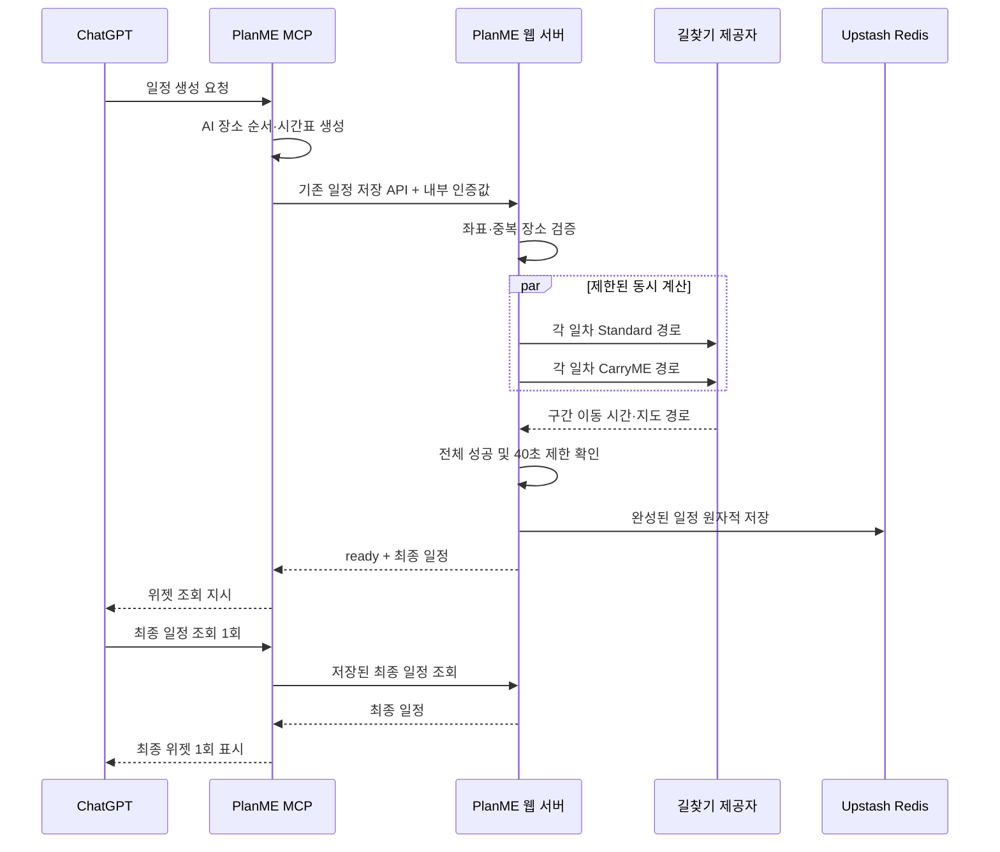

# 서버 최종 경로 계산 설계

## 결론

- 추천 설계: 기존 웹 일정 저장 API가 AI 일정을 받은 뒤 모든 일차의 Standard·CarryME 경로를 계산하고, 전체 성공 결과만 Redis에 저장한다.
- 결정 이유: 웹 서버가 현재 네이버 길찾기 API와 Redis 저장소를 소유하고 있어 MCP와 웹의 계산 로직 중복을 피할 수 있다.
- 핵심 제한: 체류 시간과 방문 시각은 계산하지 않는다. 기존 `durationMinutes`와 `durationLabel`은 최종 저장 이후 순수 이동 시간만 의미한다.

## 배경

현재 AI 일정은 예상 경로 시간을 포함해 먼저 저장되고, 상세 웹의 선택 일차 효과에서 제공자 경로를 다시 계산해 화면 상태를 덮어쓴다. 그 결과 ChatGPT 위젯과 상세 웹의 시간이 다르고, 일차 최초 선택 때 시간과 경로가 다시 로딩된다.

관련 코드:

- [일정 저장소](../../../../apps/web/lib/preview-itinerary-store.ts)
- [MCP 일정 생성 및 저장](../../../../apps/mcp/src/planme-mcp.ts)
- [네이버 자동차 길찾기 API](../../../../apps/web/app/api/naver/directions/routes/route.ts)
- [브라우저 경로 계산](../../../../apps/web/components/itinerary/ItineraryDashboard.tsx)

## 목표와 비목표

### 목표

- 새 AI 일정은 길찾기 계산 완료 전까지 최종 저장하지 않는다.
- 모든 일차의 Standard·CarryME가 성공해야 전체 결과를 확정한다.
- 자동차는 네이버, 대중교통은 현재 사용 중인 ODsay 기반 경로 계산 결과를 사용한다.
- 구간별 이동 시간 합계를 경로별 총 이동 시간으로 저장한다.
- 제공자 지도 경로를 함께 저장해 상세 웹에서 다시 길찾기를 호출하지 않는다.
- 전체 좌표 확인과 길찾기를 재시도 포함 40초 안에 끝낸다.

### 비목표

- 관광·식사·체류 시간 계산
- AI 시간표의 방문 시각 변경
- 전체 일정 소요 시간 계산
- 장소 자동 삭제 또는 AI 일정 자동 재생성
- 과거 ChatGPT 대화에 이미 렌더링된 위젯 갱신

## 데이터 흐름



## 계산 서비스

웹 서버에 경로 계산을 담당하는 공용 서버 모듈을 둔다. Next.js 경로 핸들러와 상세 일정의 기존 링크 보정이 같은 모듈을 사용한다.

업무 의미(최종 경로 계산 함수)의 입력:

- AI가 생성한 전체 일정
- 일정 전체 이동 수단: 자동차 또는 대중교통
- 전체 제한시간: 40초
- 요청 식별자와 기준 저장 버전

업무 의미(최종 경로 계산 함수)의 출력:

- 모든 일차의 Standard·CarryME 경로
- 각 경로의 구간별 순수 이동 시간
- 각 경로의 총 이동 시간
- 지도 경로와 대중교통 탑승·하차 마커
- Standard와 CarryME의 이동 시간 차이
- 제공자 계산 완료 시각

계산 규칙:

1. 연속된 동일 장소와 동일 좌표를 제거한다.
2. 좌표가 없으면 선행 좌표 보장 정책으로 네이버 대표 좌표를 선택한다.
3. 자동차 일정은 네이버 자동차 길찾기를 사용한다.
4. 대중교통 일정은 현재 ODsay 경로 계산을 서버 모듈로 이전해 사용한다.
5. 실패한 구간만 한 번 재시도한다.
6. 모든 요청과 재시도는 하나의 40초 제한을 공유한다.
7. 하나라도 실패하면 계산 중간 결과를 버리고 기존 저장값을 변경하지 않는다.

동시성은 제공자 호출 폭주를 피하도록 최대 두 경로만 동시에 처리한다. 한 경로 안에서 순서가 필요한 구간은 현재 순서를 유지한다.

## API 계약

### AI 일정 최종 계산 및 저장

- 업무 의미(기존 일정 저장 API): `POST /api/gpt/itineraries/preview-store`
- 호출자: PlanME MCP 서버
- 인증: `Authorization: Bearer <PLANME_INTERNAL_API_TOKEN>`
- 요청 본문: 현재 `PlanmeItinerary` 초안
- 제한시간: 서버 내부 40초

성공 응답:

```json
{
  "status": "ready",
  "itineraryId": "generated-...",
  "pageUrl": "https://planme-demo.vercel.app/itinerary/generated-...",
  "ogImageUrl": "https://planme-demo.vercel.app/og/itinerary/generated-...",
  "expiresAt": "2026-07-17T00:00:00.000Z",
  "itinerary": "최종 계산된 PlanmeItinerary"
}
```

오류 응답:

| 상태 | 업무 의미 | 응답 코드 |
| ---: | --- | --- |
| 400 | 일정 구조 또는 좌표 보정 입력 오류 | `INVALID_ITINERARY` |
| 401 | 내부 인증값 누락 또는 불일치 | `UNAUTHORIZED_INTERNAL_REQUEST` |
| 409 | 같은 일정의 기준 버전이 변경됨 | `ITINERARY_VERSION_CONFLICT` |
| 422 | 일부 경로를 계산하지 못함 | `ROUTE_FINALIZATION_FAILED` |
| 504 | 좌표 검색과 경로 계산이 40초 초과 | `ROUTE_FINALIZATION_TIMEOUT` |
| 500 | Redis 저장 실패 | `PREVIEW_STORE_UNAVAILABLE` |

필수·선택 기준:

- 인증 헤더: 필수, 빈 문자열 불가
- 일정 식별자와 일차 배열: 필수
- 이동 수단: 필수, 자동차 또는 대중교통
- 좌표: 입력 시 선택이지만 최종 계산 전 모든 행선지에 필수
- 체류 시간과 전체 일정 소요 시간: 계약에 추가하지 않음

### 기존 상세 일정 및 편집 경로 재계산

- 업무 의미(저장 일정 경로 재계산 API): `POST /api/gpt/itineraries/{itineraryId}/routes/finalize`
- 호출자: 상세 웹
- 요청 본문: 기준 저장 버전(`baseRevision`)과 편집된 전체 일정(편집 시에만)
- 동작: 서버가 저장된 일정 식별자를 확인하고 같은 최종 경로 계산 함수를 실행한다.

브라우저에는 내부 인증값을 전달할 수 없으므로 다음 조건을 모두 적용한다.

- Redis에 존재하는 일정 식별자만 계산한다.
- 요청의 기준 저장 버전이 현재 값과 일치해야 한다.
- 일정 식별자와 요청 출처 단위로 호출 횟수를 제한한다.
- 동일 일정의 계산 잠금이 있으면 중복 계산을 시작하지 않는다.
- 클라이언트가 전달한 좌표나 경로 결과를 신뢰하지 않고 서버에서 다시 검증한다.

추가 오류 응답:

| 상태 | 업무 의미 | 응답 코드 |
| ---: | --- | --- |
| 404 | 저장된 일정이 없음 | `ITINERARY_NOT_FOUND` |
| 409 | 기준 저장 버전 불일치 또는 계산 진행 중 | `ITINERARY_VERSION_CONFLICT` |
| 429 | 같은 일정 또는 요청 출처의 호출 제한 초과 | `ROUTE_FINALIZATION_RATE_LIMITED` |
| 422 | 일부 경로 계산 실패 | `ROUTE_FINALIZATION_FAILED` |
| 504 | 전체 40초 제한 초과 | `ROUTE_FINALIZATION_TIMEOUT` |

## 저장 설계

현재 Upstash Redis와 7일 만료 정책을 유지한다. 저장 래퍼를 버전 2로 확장한다.

```ts
type StoredPreviewItineraryV2 = {
  version: 2;
  revision: number;
  itinerary: PlanmeItinerary;
  routeCalculation: {
    status: "completed";
    calculatedAt: string;
    transportMode: "drive" | "transit";
  };
  savedAt: string;
  expiresAt: string;
};
```

저장 원칙:

- `calculating` 중간 상태는 최종 일정 키에 저장하지 않는다.
- 새 결과는 모든 경로가 성공한 뒤 한 번에 저장한다.
- 경로의 `durationMinutes`와 `durationLabel`은 순수 이동 시간만 저장한다.
- AI 시간표 배열은 변경하지 않는다.
- 지도 형상은 경로 구간 배열을 기준으로 한 번만 저장하고, 중복된 전체 평탄화 경로는 클라이언트에서 파생한다.
- 편집 재계산은 기준 `revision`이 일치할 때만 교체한다.
- 계산 잠금은 별도 Redis 키에 45초 만료로 저장해 서버 종료 후에도 자동 해제되게 한다.

## 기존 일정 호환

- 버전 1 일정은 상세 링크 최초 접근 시 계산 대상으로 판정한다.
- 화면은 AI 장소 순서와 지도 마커를 표시하고 이동 시간·지도 경로를 `계산 중`으로 둔다.
- 계산 성공 시 버전 2로 교체한다.
- 계산 실패 시 버전 1 원본을 유지하되 AI 예상 이동 시간은 최종값처럼 표시하지 않는다.
- 과거 ChatGPT 위젯은 소급 갱신하지 않는다.

## 인증과 보안

- `PLANME_INTERNAL_API_TOKEN`을 코드나 공개 환경변수에 넣지 않는다.
- MCP와 웹의 서버 런타임 환경에서만 읽는다.
- 비교 실패 시 요청 본문을 로그에 남기지 않는다.
- 인증값과 제공자 키는 오류 메시지에 포함하지 않는다.
- 구현 시 원본 `main`과 이번 구현 워크트리의 앱별 `.env.local`, `.env.development`에 동일 값을 반영한다.
- Vercel의 `planme-demo`, `planme-demo-mcp` 프로젝트에 같은 서버 비밀값을 반영한다.

## 대안과 선택 이유

### MCP 서버에서 직접 계산

- 기각 이유: 자동차·대중교통 제공자 코드와 키를 MCP에 중복 배치해야 하며 웹 편집 재계산과 결과가 달라질 수 있다.

### 계산 중 위젯을 먼저 표시하고 자동 갱신

- 기각 이유: 위젯 상태 확인 API와 폴링이 추가되고, 기존의 준비된 위젯 1회 표시 흐름을 복잡하게 만든다.

### 인증 없는 공개 계산 API

- 기각 이유: 외부 반복 호출로 지도 API 사용량과 Redis 저장량을 소모할 수 있다.

## 리스크

- 40초 안에 많은 일차를 모두 계산하지 못할 수 있다.
- 대중교통 제공자가 전체 지도 형상을 제공하지 않는 구간이 있다.
- 현재 ODsay 웹 키는 등록 운영 주소를 `Referer`로 고정한 Node 서버 호출에서 인증 성공을 확인했다. `Referer`는 강한 비밀 인증이 아니며 Basic 호출 제한이 있으므로 서버가 값을 고정하고 요청 시작 간격을 제한한다.
- 경로 형상 저장으로 Redis 값 크기가 증가한다.
- 웹과 MCP 배포 완료 시점이 어긋나면 잠시 일정 생성이 실패할 수 있다.

대응은 [배포·검증 설계](rollout-and-validation.md)에서 다룬다.
