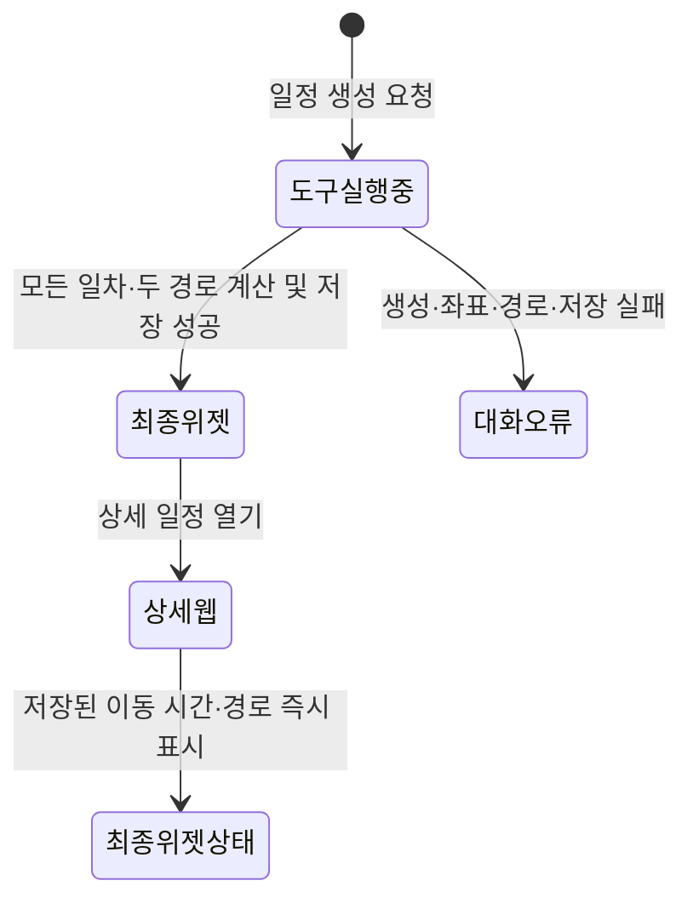
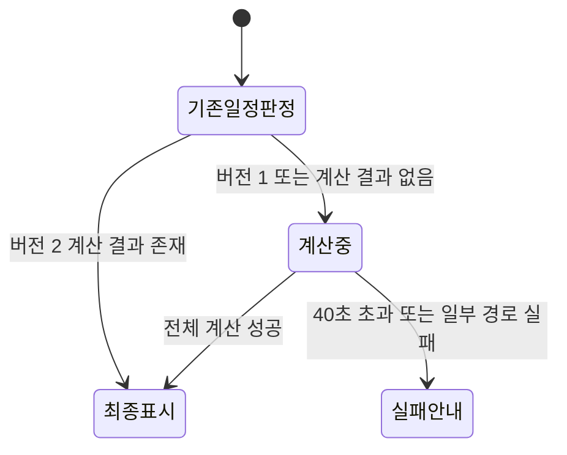

# ChatGPT 위젯·상세 웹 상태 설계

## 결론

- ChatGPT에서는 서버 계산 중 도구 실행 상태만 표시하고, 전체 성공 후 최종 위젯을 한 번 표시한다.
- 상세 웹은 저장된 최종 이동 시간과 지도 경로를 즉시 사용하며 일차 탭 전환으로 다시 계산하지 않는다.
- AI 장소 순서와 시간표 내용은 유지한다.

## 사용자 흐름

### 새 일정 생성

표시 기준:

- 도구 실행 중: `PlanME 일정을 구성하는 중입니다.`
- 성공: 최종 이동 시간이 반영된 위젯 하나
- 실패: 위젯을 만들지 않고 `일정을 완성하지 못했습니다. 다시 요청해주세요.` 안내

### 기존 상세 링크

계산 중에도 AI 장소 순서와 지도 마커는 표시할 수 있다. 이동 시간, 절약 시간, 지도 선은 최종 결과가 준비될 때까지 표시하지 않는다.

## ChatGPT 위젯 설계

현재 위젯 구조와 `get_planme_itinerary` 1회 호출 원칙을 유지한다.

변경점:

- `recommend_planme_itinerary`는 웹 최종 계산과 저장 성공 후에만 `ready`를 반환한다.
- `get_planme_itinerary`는 MCP 프로세스의 AI 초안이 아니라 웹에 저장된 최종 일정을 조회한다.
- 위젯은 첫째 날의 기존 AI 시간표 내용을 유지한다.
- Standard와 CarryME 경로 설명에 최종 이동 시간을 표시한다.
- CarryME 총 이동 시간도 같은 최종 제공자 결과를 사용한다.
- `savedMinutes`와 절약 문구는 두 최종 이동 시간의 차이로 다시 계산한다.

위젯을 여러 번 띄우지 않도록 생성 도구에는 위젯 템플릿을 연결하지 않고, 조회 도구에만 연결한다.

## 상세 웹 설계

### 계산 완료 일정

- `editableDays`는 저장된 AI 장소 순서와 시간표를 초기값으로 사용한다.
- `computedRoutes`는 저장된 제공자 이동 시간과 지도 경로로 초기화한다.
- 초기 렌더링과 일차 탭 전환에서 경로 API를 호출하지 않는다.
- 일차별 Standard·CarryME 총 이동 시간은 저장된 값을 사용한다.
- 지도는 저장된 구간 경로를 즉시 그린다.

### 기존 일정 및 편집 재계산

- 장소 순서와 마커는 유지한다.
- 경로 선, 총 이동 시간, 절약 시간은 `계산 중`으로 숨긴다.
- 전체 성공 후 한 번에 새 결과를 적용한다.
- 실패하면 마지막 성공 일정으로 되돌리고 실패 안내를 표시한다.
- 계산 중에는 행선지 교체, 이동 수단 변경, 경유지 추가, 재계산 버튼을 비활성화한다.

## 화면별 데이터 기준

| 표시 항목 | 계산 전 | 계산 완료 | 출처 |
| --- | --- | --- | --- |
| 장소 순서 | 표시 | 표시 | AI 일정 |
| 시간표 시각·설명 | 표시 | 동일하게 표시 | AI 일정 |
| 지도 마커 | 표시 | 표시 | 확정 좌표 |
| Standard 총 이동 시간 | `계산 중` | 표시 | 길찾기 제공자 구간 합계 |
| CarryME 총 이동 시간 | `계산 중` | 표시 | 길찾기 제공자 구간 합계 |
| 절약 시간 | 숨김 | 표시 | 두 총 이동 시간 차이 |
| 지도 경로 | 숨김 | 표시 | 길찾기 제공자 형상 |

## 오류 처리

### ChatGPT

- 위젯을 표시하기 전 실패: 대화 메시지만 표시한다.
- 이미 최종 위젯이 표시된 뒤에는 새 계산을 자동 시작하지 않는다.

### 상세 웹

- 초기 기존 일정 계산 실패: `일정을 완성하지 못했습니다. 다시 요청해주세요.`
- 편집 재계산 실패: `변경한 일정의 경로를 계산하지 못했습니다.`
- 일부 경로만 성공: 부분 결과를 표시하지 않는다.
- 지도 형상만 일부 제공되는 대중교통: 이동 시간은 모든 구간이 성공한 경우에만 표시하고, 지도에는 제공 가능한 형상과 탑승·하차 마커를 표시한다.

## 접근성과 반응형

- `계산 중`과 실패 문구를 색상만으로 구분하지 않는다.
- 계산 중 비활성화된 버튼에는 비활성 이유를 보조 문구로 제공한다.
- 지도 경로가 없을 때 마커만 표시해도 지도 영역의 높이를 유지한다.
- 모바일과 데스크톱 모두 일차 탭 전환 시 레이아웃 높이가 급격히 바뀌지 않게 한다.

## 리스크

- AI 시간표의 시각과 실제 이동 시간이 논리적으로 맞지 않을 수 있다. 이번 범위에서는 시간표를 다시 계산하지 않는다는 확정사항을 우선한다.
- 기존 위젯은 첫째 날만 미리 보여주므로 모든 일차 상세는 웹에서 확인해야 한다.
- 대중교통 지도 형상이 부분 제공이면 자동차와 시각적 완성도가 다를 수 있다.
