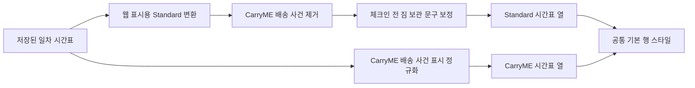

# 웹 상세 시간표 컴포넌트 설계

## 결론

웹 상세 화면에 시간표 표시 전용 변환 계층을 둔다. 이 계층은 기존 저장 일정의 Standard 배송 사건을 제거하고 제한된 체크인 문구를 보정한다. `TimelinePanel`은 일정 종류에 관계없이 행 배경·체크·행 내부 절약 칩을 표시하지 않으며 CarryME 배송 아이콘의 빛나는 효과만 유지한다.

## 컴포넌트 흐름

## 웹 표시용 Standard 변환

### CarryME 배송 사건 제거

- `category=carryme`인 사건은 Standard 표시 목록에서 제외한다.
- 잘못된 분류를 대비해 짐 배송 완료를 뜻하는 제목·설명도 제한적으로 제외한다.
- 여행자의 호텔 체크인·호텔 도착·호텔 복귀·숙박 사건은 유지한다.
- 같은 호텔이라는 이유만으로 사건을 합치지 않는다.
- 시간과 장소가 같은 여행자 호텔 도착과 짐 도착이 있으면 짐 도착만 제거한다.

### 기존 체크인 문구 보정

체크인 의미가 제목에 명시된 `체크인 전 짐 보관` 유형만 보정한다.

- 제목: `{호텔명} 체크인`
- 설명: `호텔에 체크인한 뒤 다음 일정으로 이동합니다.`

일반 `짐 보관`, `짐 맡기기` 문구를 전부 체크인으로 바꾸지 않는다. 잘못된 의미 확장을 피하기 위해 체크인 단서가 있는 사건만 대상으로 한다.

## 일정 행 시각 구조

### 양쪽 열에서 제거

- `highlight`에 따른 연한 초록 배경과 테두리
- 행 오른쪽의 초록 체크 아이콘
- `savingLabel`에 따른 제목 옆 빨간 칩

이 값들은 원본 데이터에서 제거하지 않고 웹 상세 시간표 행에서만 렌더링하지 않는다.

### 유지

- 시간, 분류 아이콘, 제목, 설명과 세로 연결선
- Standard와 CarryME 열 제목 및 색상 구분
- CarryME 짐 배송 사건의 배송 차량 아이콘
- CarryME 짐 배송 사건 아이콘의 빛나는 효과
- Standard와 CarryME 총 이동 시간 상자
- CarryME 총 이동 시간 상자 오른쪽 빨간 절약 칩
- CarryME 짐 맡기기 데모 버튼

## 아이콘 강조 규칙

기존에는 `event.highlight`가 참이면 모든 분류의 아이콘이 빛날 수 있다. 변경 후 빛나는 효과는 CarryME 열의 짐 배송 사건에만 적용한다. 기존 저장값의 분류가 잘못됐을 수 있으므로 `category` 하나만 보지 않고 공통 배송 사건 판별 함수를 사용한다.

- 조건: CarryME 열이며 공통 의미 판별 결과가 짐 배송 사건인 경우
- 배송 사건이면 표시 아이콘은 배송 차량 아이콘을 사용한다.
- Standard에서는 배송 차량 아이콘과 빛나는 효과를 표시하지 않는다.
- 다른 관광·도착·숙박 아이콘은 기본 그림자만 사용한다.

## 테마와 반응형

- 밝은 테마와 어두운 테마에 같은 의미 규칙을 적용한다.
- 행 배경 제거 후 각 테마의 기본 배경과 기본 본문 색상을 사용한다.
- 기존 2열 데스크톱과 세로 적층 모바일 구조는 변경하지 않는다.
- 행 제거 후 빈 높이를 남기지 않고 남은 사건을 연속해서 렌더링한다.

## 접근성

- 시각 장식을 제거해도 시간·제목·설명 텍스트를 유지한다.
- CarryME 배송 사건은 아이콘만으로 의미를 전달하지 않고 `짐 호텔 도착` 제목을 유지한다.
- Standard 배송 사건 제거 후 DOM과 접근성 트리에도 해당 행이 남지 않아야 한다.

## 비목표

- ChatGPT 위젯 HTML/CSS 변경
- 공유 이미지 레이아웃 변경
- 지도 경로와 호텔 stop 제거
- 총 이동 시간 또는 절약 시간 계산 변경
- 이동 수단 선택과 경로 재계산 변경

## 리스크

- 표시 변환이 데이터 변환과 중복되면 신규 일정과 기존 일정의 결과가 달라질 수 있다.
- 문구 보정이 넓으면 실제 체크인 전 보관만 제공하는 일정을 체크인으로 오표현할 수 있다.
- 행 시각 강조 제거로 Standard와 CarryME 차이가 약해질 수 있으므로 열 제목·색상과 CarryME 배송 아이콘을 유지한다.

## References

- [TimelinePanel.tsx](../../../../apps/web/components/itinerary/TimelinePanel.tsx) - 행 스타일과 총 이동 시간 상자 구현 위치.
- [ItineraryDashboard.tsx](../../../../apps/web/components/itinerary/ItineraryDashboard.tsx) - 시간표 데이터 선택과 전달 위치.
- [일정 행 강조 표시 인터뷰](../01_interview/timeline-visual-policy.md) - 제거·유지할 시각 요소 확정 근거.
