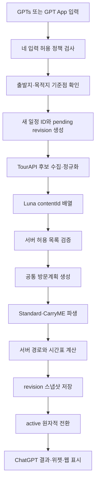

# 아키텍처와 도메인 모델

## 결론

V3는 기존 `PlanmeItinerary`를 확장하지 않고, 사용자 의도·TourAPI 장소·공통 방문계획·서버 파생 경로·저장 revision을 분리한 새 계약으로 만든다.
웹 서버가 하나의 일정 오케스트레이터를 소유하고 GPTs Actions와 GPT App MCP는 내부 인증 API를 호출하는 채널 어댑터가 된다. 채널 어댑터는 입력 정규화와 표시 형식만 담당한다.

AI는 일정의 소유자가 아니다. 서버가 만든 후보 허용 목록 안에서 `contentId`와 순서만 제안하고, 서버가 검증·시간표·경로·저장을 완료해야만 `ready`가 된다.

## 책임 경계

| 계층 | 책임 | 금지 |
| --- | --- | --- |
| 채널 어댑터 | 네 입력 수집, 자발적 선택 정보 전달, 상태 조회, 채널별 표시 | 장소·시간표 생성, 추가 질문 정책 변경 |
| 일정 오케스트레이터 | 단계 전이, 재시도, fallback, revision과 결과 조립 | 채널별 별도 생성 로직 |
| TourAPI 계층 | 후보 조회, 정규화, 유형별 캐시, 좌표 검증 | AI가 만든 장소 보강, 다른 장소 공급자 fallback |
| AI 배열 계층 | 허용된 `contentId` 선택, 일차와 순서 배분 | 이름·좌표·시간·경로·설명 생성 |
| 일정 계산기 | 체류·식사·숙소·자유시간과 두 경로 변형 생성 | 외부 장소 추가 |
| 경로 계층 | 네이버·ODsay 호출, 오류 행렬, 예상 도보 | 브라우저 계산, 조용한 성공 처리 |
| 저장 계층 | 작업 상태, revision, 원자적 활성화, 멱등성 | 부분 계산을 `active`로 노출 |

## 런타임 배치

| 런타임 | 소유 책임 | 서버 전용 환경변수 |
| --- | --- | --- |
| `apps/web` | V3 오케스트레이터, TourAPI, Luna, 일정 계산, 네이버·ODsay 경로, Redis, 상태·편집 API | `OPENAI_API_KEY`, TourAPI 서비스 키, 지도·ODsay 서버 키, Upstash, 내부 API 토큰 |
| `apps/mcp` | GPT App MCP 도구, GPTs Actions 스키마·어댑터, 웹 내부 API 호출, 위젯 표시 | `PLANME_WEB_ORIGIN`, `PLANME_INTERNAL_API_TOKEN` |
| `packages/planme-core` | 공급자에 독립적인 V3 타입, 검증, 일정 계산, 결정적 배열 로직 | 없음 |

기존 [MCP 전용 AI 생성 설계](../../../superpowers/specs/2026-07-07-planme-mcp-only-ai-generation-design.md)의 “OpenAI 키는 MCP 배포에만 둔다”는 결정은 V3 생성 경로에서 교체한다. V3에서는 웹 서버가 생성의 단일 소유자이며, MCP에 별도 AI 생성 fallback을 남기지 않는다.

## 공통 처리 흐름



AI가 실패하면 같은 Luna 요청을 한 번 재시도한다. 두 번째도 실패하거나 출력 검증에 실패하면 서버의 결정적 배열기로 `F`를 대체한다. 다른 모델이나 V2 생성기로 전환하지 않는다.

## V3 도메인 계약

### 사용자 입력(TripIntentInput)

```ts
type TripIntentInput = {
  origin?: string;
  destination?: string;
  transportMode?: "drive" | "transit";
  durationDays?: number;
  travelStartDate?: string;
  preferences?: string[];
  requestedPlaces?: string[];
  travelerCount?: number;
  luggageCount?: number;
};
```

- `origin`, `destination`, `transportMode`, `durationDays`가 생성 전 필수다.
- 누락 시 이 네 항목만 질문할 수 있다.
- 나머지는 사용자가 자발적으로 제공했을 때만 검증 후 사용한다.
- 기본값은 `travelerCount=1`, `luggageCount=1`이며 기본값 확인을 위해 질문하지 않는다.
- `durationDays`는 현재 공개 계약과 동일하게 1~14 범위를 유지한다.

### 경로 기준점(RouteAnchor)

```ts
type RouteAnchor = {
  kind: "origin" | "destination";
  label: string;
  coordinate: { lat: number; lng: number };
  source: "naver_geocode";
  sourceRef: string;
};
```

경로 기준점은 관광 장소가 아니다. 네이버 지오코딩으로 확인할 수 있지만 TourAPI 후보나 방문 장소로 승격하지 않는다. AI 입력에는 고정값으로 전달하며 AI 출력으로 덮어쓸 수 없다.

### TourAPI 장소(TourPlaceSnapshot)

```ts
type TourPlaceSnapshot = {
  contentId: string;
  contentTypeId: 12 | 14 | 15 | 28 | 32 | 38 | 39;
  title: string;
  coordinate: { lat: number; lng: number };
  address?: string;
  regionCode?: string;
  districtCode?: string;
  fetchedAt: string;
  cacheStatus: "fresh" | "stale";
  source: "tourapi";
};
```

- 여행코스 유형 25는 허용하지 않는다.
- V1 스냅샷에는 TourAPI 전체 응답과 이미지 바이너리를 저장하지 않는다.
- 이미지 URL은 일정 성립에 필요하지 않으므로 초기 필수 계약에서 제외한다.
- 최종 revision은 선택된 장소의 스냅샷을 내장해 외부 데이터 변경과 무관하게 재현한다.

### AI 선택(AiPlanSelection)

```ts
type AiPlanSelection = {
  lodgingContentId: string;
  days: Array<{
    day: number;
    orderedVisitContentIds: string[];
    restaurantContentIds: string[];
  }>;
};
```

이 계약에는 장소명, 좌표, 시간, 체류시간, 설명과 경로가 없다. 서버는 모든 ID가 후보 스냅샷에 존재하는지, 유형이 슬롯과 맞는지, 숙소 외 중복이 없는지 검증한다.

### 공통 방문계획(TripPlan)

```ts
type TripPlan = {
  intent: ResolvedTripIntent;
  lodging: TourPlaceSnapshot;
  selectedPlaces: Record<string, TourPlaceSnapshot>;
  days: Array<{
    day: number;
    visits: Array<{ contentId: string; stayMinutes: number }>;
    meals: Array<{ kind: "lunch" | "dinner"; contentId?: string }>;
    freeTimePolicy: "free_time" | "lodging_rest";
  }>;
  excludedRequestedPlaces: Array<{
    input: string;
    reason: "TOURAPI_NOT_FOUND" | "INVALID_COORDINATE" | "UNROUTABLE";
  }>;
};
```

`TripPlan`이 장소 선택과 순서의 단일 원천이다. Standard·CarryME는 별도 장소 목록을 직접 수정하지 않고 이 계획에서 파생한다.

### 파생 일정과 경로(ItineraryRevision)

```ts
type ItineraryRevision = {
  schemaVersion: 3;
  itineraryId: string;
  revision: number;
  createdAt: string;
  intent: ResolvedTripIntent;
  plan: TripPlan;
  standard: RouteVariant;
  carryme: RouteVariant;
  selectedPlaceSnapshots: Record<string, TourPlaceSnapshot>;
};
```

`RouteVariant`는 `TripPlan`을 참조하는 여행자 이동 구간, 수하물 이동 구간, 서버 계산 시간표와 제공자 경로 결과를 가진다. 같은 장소의 이름·좌표를 두 변형에 복사해 수정하는 구조를 피하고 `contentId` 참조로 결합한다.

## Standard와 CarryME 파생 규칙

- 두 변형은 같은 숙소와 같은 관광 방문 순서를 사용한다.
- Standard는 여행자가 수하물을 직접 숙소에 맡기거나 찾기 위해 필요한 숙소 경유를 포함한다.
- CarryME는 여행자의 불필요한 숙소 경유를 제거하고 수하물 이동을 별도 구간으로 표현한다.
- 수하물 이동 이벤트는 여행자 방문 장소가 아니며 `TripPlan.days[].visits`에 들어가지 않는다.
- 웹 편집은 `TripPlan`만 변경하고 두 변형과 시간표를 전부 다시 만든다.
- saving 값은 같은 revision의 두 서버 계산 결과 차이에서만 계산한다.

## 작업 상태 머신과 채널 실행

새 외부 작업 큐를 도입하지 않는다. 웹 서버의 시작 요청은 Redis에 작업을 만들고 웹 내부 `advance` 명령이 한 번에 한 단계를 전진시킨다. GPTs는 한 Action 요청 안에서 `runUntilTerminal`로 이 명령을 반복하되 42초 내부 예산을 넘기지 않는다. GPT App은 처리 중 위젯이 사용자 동작 없이 MCP 상태 도구를 자동 호출한다.

```text
queued
  -> resolving_anchors
  -> collecting_candidates
  -> arranging
  -> scheduling
  -> routing(n/m)
  -> activating
  -> ready

어느 단계에서든 복구 불가 오류 -> failed
```

- 상태 조회 자체는 읽기 전용이고, 단계 진행은 내부 `POST advance` 명령으로 분리한다.
- GPTs 어댑터는 외부 응답을 반환하기 전에 내부 단계를 terminal 상태까지 실행하며 `processing`을 공개 응답으로 반환하지 않는다.
- GPT App의 `get_planme_itinerary` 어댑터는 먼저 `advance`를 호출하고, 처리 중 위젯이 terminal 상태까지 다시 호출하므로 사용자는 별도 조작을 하지 않는다.
- 한 `advance`는 하나의 단계 또는 하나의 경로 작업 묶음만 처리한다.
- 단계 잠금과 예상 상태 비교로 중복 조회가 같은 단계를 동시에 활성화하지 못하게 한다.
- 새 생성 실패는 `failed` 작업만 남기고 `active`를 만들지 않는다.
- 편집 실패는 `pending`을 폐기하고 기존 `active`를 유지한다.

## 대안과 기각 이유

### 기존 PlanmeItinerary에 contentId만 추가

AI 시간표와 Standard·CarryME 중복 장소가 남아 책임 경계가 바뀌지 않으므로 기각한다.

### AI가 TourAPI를 함수 호출

AI가 검색 범위·재호출·후보 누락을 소유하게 되고 캐시·오류 정책을 서버에서 일관되게 강제하기 어려워 기각한다.

### 모든 채널을 하나의 동기 요청으로 통일

GPT App까지 동기 처리하면 긴 일정에서 응답 제한을 넘기기 쉽다. GPTs는 공식 45초 제한 때문에 42초 예산의 동기 실행을 사용하고, GPT App은 처리 중 위젯 자동 호출을 사용하는 채널별 전달 전략을 선택한다.

### 외부 작업 큐 신규 도입

현재 범위에 없는 인프라·비용·운영 권한이 필요하다. 기존 Redis와 반복 조회로 단계 실행을 분할할 수 있어 이번 설계에서는 도입하지 않는다.

## 리스크

- GPTs는 42초 안에 terminal 상태가 되지 않으면 부분 결과 없이 실패한다. 1일·14일 공급자 mock 성능 게이트로 시간 예산을 검증한다.
- GPT App 처리 중 위젯의 자동 도구 호출이 중단되면 작업이 `processing`에 남을 수 있다. 호출 상한과 작업 TTL로 무한 반복을 막는다.
- RouteVariant 참조 구조로 화면 DTO 변환 계층이 추가된다. 저장 도메인과 표시 DTO를 분리해 화면 편의를 저장 중복으로 되돌리지 않는다.
- 단계별 재시도에서 외부 API가 중복 호출될 수 있다. 단계 결과 저장과 상태 비교 후 다음 단계로 이동해 중복 호출이 활성 결과를 바꾸지 못하게 한다.

## References

- [인터뷰 인덱스](../01_interview/index.md)
- [현재 일정 도메인](../../../../packages/planme-core/src/mock-data.ts)
- [현재 AI 생성기](../../../../packages/planme-core/src/openai-itinerary-generator.ts)
- [현재 생성 오케스트레이션](../../../../packages/planme-core/src/gpt-actions.ts)
- [현재 서버 경로 확정기](../../../../apps/web/lib/itinerary-route-finalizer.ts)
