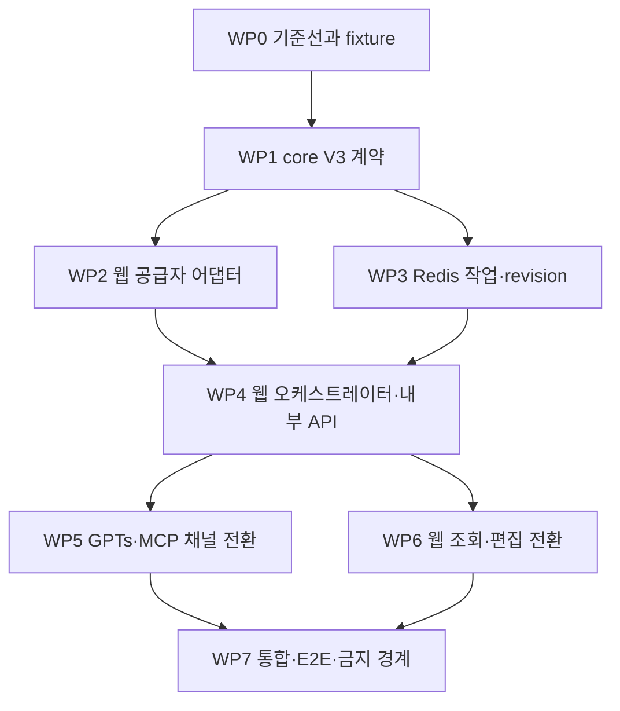

# 전체 구현 순서

## 결론

- 구현 방향: 기존 V2를 즉시 삭제하지 않고 V3 공통 계약과 웹 오케스트레이터를 먼저 완성한 뒤, MCP·GPTs와 웹 화면을 순차 전환한다.
- 완료 조건: 모든 V3 채널이 웹의 같은 active revision을 읽고 V3-01~V3-10이 자동 통과한다.
- 주요 리스크: 생성·경로·저장 책임이 MCP, 웹 서버, 브라우저에 분산된 현재 구조에서 일부 경로만 전환하면 두 일정이 동시에 존재할 수 있다.

## 범위

### 포함

- 공급자 독립 V3 타입·검증·결정적 배열·시간표 정책
- 웹 서버의 TourAPI·Luna·경로·Redis 오케스트레이션
- V3 작업 상태와 active/pending/previous revision
- GPTs Actions와 GPT App MCP의 얇은 웹 API 어댑터 전환
- 웹 상세 조회·편집과 TourAPI 장소 검색 전환
- 브라우저 ODsay·네이버 Directions 호출 제거
- V3 필수 회귀·통합·E2E 검사

### 제외

- 여러 숙소 사용, 일차 수 편집, V1/V2 데이터 이관
- 기존 V1/V2 키의 적극 삭제
- 외부 작업 큐·새 데이터베이스 도입
- 배포 feature flag와 배포 rollback 설계
- Vercel 환경변수 변경, PR 병합, 운영 배포
- 승인 없는 실제 외부 API 호출

## 작업 묶음과 의존성

## 작업 순서

### WP0. 기준선과 고정 fixture

1. 현재 명령의 성공·실패 기준선을 기록한다.
2. 기존 V2 fixture와 assertion 중 V3에서 제거해야 할 AI 시간표·네이버 장소·clarification 의존을 표시한다.
3. TourAPI, Luna, ODsay, 네이버의 모의 응답 fixture를 민감값 없이 만든다.
4. GPT App MCP의 JSON-RPC 요청 ID와 GPTs Actions의 필수 기술 필드 `invocationId`를 도구 호출 재시도 멱등성 키로 사용한다.
5. GPTs는 한 Action 안에서 42초 예산으로 terminal 상태까지 실행하고, GPT App은 처리 중 위젯이 사용자 동작 없이 `get_planme_itinerary`를 자동 호출하는 계약을 검증한다.

완료 게이트:

- 기존 실패가 있으면 변경 전 실패로 분리 기록한다.
- fixture에 실제 키, 전체 요청 URL, 사용자 원문이 없다.
- 2026-07-14 승인된 채널별 전달 보완안을 문서와 테스트에 반영한다.
- GPTs 42초 동기 실행 또는 GPT App 처리 중 위젯 자동 호출이 실제 채널 계약과 맞지 않으면 채널 전환을 중단하고 설계 단계로 반환한다.

### WP1. 공통 V3 계약과 순수 정책

1. `packages/planme-core/src/v3/`에 입력, 후보, 선택, 계획, revision, 표시 DTO를 추가한다.
2. TourAPI 후보 정규화와 AI 출력의 strict 검증기를 추가한다.
3. 결정적 배열기, 일정 계산기, ODsay 오류 결정표를 순수 함수로 구현한다.
4. 기존 V1/V2 export를 바꾸지 않고 새 V3 export를 추가한다.

완료 게이트:

- 외부 공급자나 환경변수 없이 core build와 V3 단위 테스트가 가능하다.
- 신규 `unknown` 또는 `unknown[]` 타입을 도입하지 않는다.
- AI 출력에서 이름·좌표·시간 필드가 허용되지 않는다.

### WP2. 웹 서버 공급자 어댑터

1. TourAPI 클라이언트와 응답 파서를 웹 서버에 추가한다.
2. OpenAI Responses API를 `gpt-5.6-luna`, `reasoning.effort=low`로 호출한다.
3. 네이버 지오코딩·Directions와 ODsay를 서버 전용 인터페이스로 묶는다.
4. ODsay 서버 키는 `ODSAY_API_KEY`만 사용하고 브라우저 공개 키 의존을 제거한다.

완료 게이트:

- MCP에는 V3 TourAPI·OpenAI 클라이언트가 없다.
- 공급자 오류는 안정된 내부 오류 코드로 변환되고 원문·키가 로그에 없다.

### WP3. Redis 작업·revision 저장소

1. V3 전용 namespace와 절대 만료시각을 정의한다.
2. 작업 meta, idempotency, pending/active/previous, 단계 잠금 저장소를 구현한다.
3. TourAPI 유형별 fresh와 last-good 캐시를 구현한다.
4. 메모리 저장소와 Redis 저장소가 같은 계약 테스트를 통과하게 한다.

완료 게이트:

- 같은 멱등성 키·같은 입력은 같은 ID, 다른 입력은 409다.
- 실패한 편집은 active를 바꾸지 않는다.
- V1/V2 키를 읽거나 삭제하지 않는다.

### WP4. 웹 오케스트레이터와 API

1. 시작, 한 단계 진행, 상태 조회, 편집 시작, 활성화 명령을 웹에 추가한다.
2. 한 `advance`가 한 단계 또는 제한된 경로 batch만 실행하게 한다.
3. TourAPI → Luna → strict 검증 → 같은 모델 1회 재시도 → 결정적 배열 순서를 고정한다.
4. 서버 일정 계산과 경로 계산이 끝난 revision만 active로 전환한다.

완료 게이트:

- ready 전 상세 링크나 부분 일정을 성공 결과로 반환하지 않는다.
- 새 생성 실패는 active를 만들지 않고, 편집 실패는 기존 active를 유지한다.
- 단계 잠금 만료 뒤 재개해도 같은 revision 결과가 바뀌지 않는다.

### WP5. GPTs Actions와 GPT App MCP 전환

1. 네 필수 질문 슬롯만 남긴다.
2. GPTs `recommend`는 필수 기술 필드 `invocationId`를 멱등성 키로 전달하고 내부 단계를 42초 안에 terminal 상태까지 실행한다.
3. GPTs 공개 응답은 ready 또는 failed만 반환하고 processing·후속 advance 호출에 의존하지 않는다.
4. GPT App `recommend`는 처리 중 위젯을 반환하며 위젯이 MCP `get_planme_itinerary`를 사용자 동작 없이 자동 호출한다.
5. MCP `get_planme_itinerary`는 웹의 한 단계 진행과 상태 조회만 수행하고 ready·failed에서 자동 호출을 멈춘다.
6. ready에서만 상세 링크를 성공 결과로 표시한다.
7. MCP의 V3 OpenAI 생성, 장소 clarification, 전체 일정 preview 전달 경로를 제거한다.

완료 게이트:

- GPTs·GPT App 입력 fixture가 같은 itinerary revision을 가리킨다.
- 허용되지 않은 사용자 질문이 schema·도구 설명·오류 문구에 없다.

### WP6. 웹 조회와 편집 전환

1. 상세 화면을 V3 active revision 표시 DTO로 연결한다.
2. 장소 검색을 TourAPI contentId 후보로 교체한다.
3. 편집 요청은 base revision과 contentId만 받아 pending revision을 만든다.
4. 브라우저 경로 확정 요청과 공급자 키·직접 호출을 제거한다.
5. processing, edit processing, failed, estimated walk 상태를 구분해 표시한다.

완료 게이트:

- 새로고침·일차 전환·편집 후 브라우저 공급자 요청이 0건이다.
- 웹에는 특정 장소 제외 안내가 없고 GPT 결과·위젯에만 있다.

### WP7. 전체 회귀와 정리

1. V3-01~V3-10을 한 번에 실행하는 `test:v3`를 추가한다.
2. 기존 스크립트와 E2E를 V3 계약으로 바꾼다.
3. 타입 검사, 빌드, 린트, MCP 검사, finalization, E2E를 실행한다.
4. V3 경로의 금지 문자열과 이중 공급자 클라이언트를 검색한다.
5. 실제 확인된 결과만 구현 결과·검증 로그에 기록한다.

## 전환 원칙

- V3 모듈과 API가 테스트로 준비되기 전 기존 호출부를 제거하지 않는다.
- 전환 커밋 안에서는 호출부 변경과 해당 계약 테스트 변경을 함께 처리한다.
- V1/V2 읽기 호환은 완료 조건이 아니지만 기존 키를 삭제하거나 전체 저장소를 초기화하지 않는다.
- 공개 도구 이름은 유지하되 요청·응답 의미가 바뀌는 부분을 OpenAPI와 도구 설명에 동시에 반영한다.
- 외부 키가 없어도 모의 계약 테스트는 전부 실행 가능해야 한다.

## 중단 조건

다음 중 하나가 발생하면 임의 구현하지 않고 현재 단계에서 중단한다.

- TourAPI 공식 응답이 설계한 필수 ID·유형·좌표 계약과 맞지 않는다.
- `gpt-5.6-luna`의 실제 Responses API structured output 계약이 계획과 다르다.
- 기존 상세 화면이 V3 표시 DTO로 변환 불가능해 저장 도메인을 다시 중복해야 한다.
- Vercel 실행 제한 안에서 한 단계 또는 route batch를 안전하게 나눌 수 없다.
- GPTs 필수 `invocationId` 또는 MCP JSON-RPC 요청 ID를 같은 전송 재시도에서 안정적으로 재사용할 수 없다.
- GPTs 42초 동기 실행이 45초 제한 전에 안전한 terminal 응답을 만들지 못한다.
- GPT App 처리 중 위젯이 사용자 추가 행동 없이 MCP 상태 도구를 호출할 수 없다.
- 신규 `unknown`, DB, 외부 큐, 비용 발생 인프라가 필요하다.
- 네 허용 입력 외의 제품 질문이 반드시 필요해진다.

## 배포와 rollback 경계

이 계획은 배포 rollback 기능을 구현하지 않는다. 회귀 방지는 배포 후 되돌리기가 아니라 전환 전 자동 게이트와 active revision 원자성으로 달성한다.

- 코드 완료 후에도 Vercel 환경변수와 실제 배포는 별도 승인 대상이다.
- 웹 서버에는 `OPENAI_API_KEY`, `TOUR_API_SERVICE_KEY`, `ODSAY_API_KEY`, 기존 네이버·Upstash·내부 토큰이 필요하다.
- 키가 없으면 외부 smoke와 운영 준비 상태는 `미확인`으로 남긴다.
- 운영 전환은 저장소 규칙대로 GitHub PR 병합을 통한 자동 배포만 사용한다.
- 두 Vercel 런타임의 배포 시점 차이로 계약 불일치가 생기지 않도록, 실제 배포는 V3 웹 내부 API를 기존 동작에 영향 없이 먼저 추가한 뒤 GPTs·MCP와 웹 UI를 전환하는 최소 두 단계 PR로 수행한다.
- 첫 단계에서는 V3에 공개 트래픽을 보내지 않고 내부 계약·환경 준비만 확인한다. 두 번째 단계는 V3-01~V3-10과 웹 V3 readiness 확인이 모두 통과해야 진행한다.

## References

- [아키텍처와 도메인 모델](../02_design/architecture-and-domain-model.md)
- [저장과 정합성](../02_design/storage-and-consistency.md)
- [검증 계획](../02_design/validation-plan.md)
