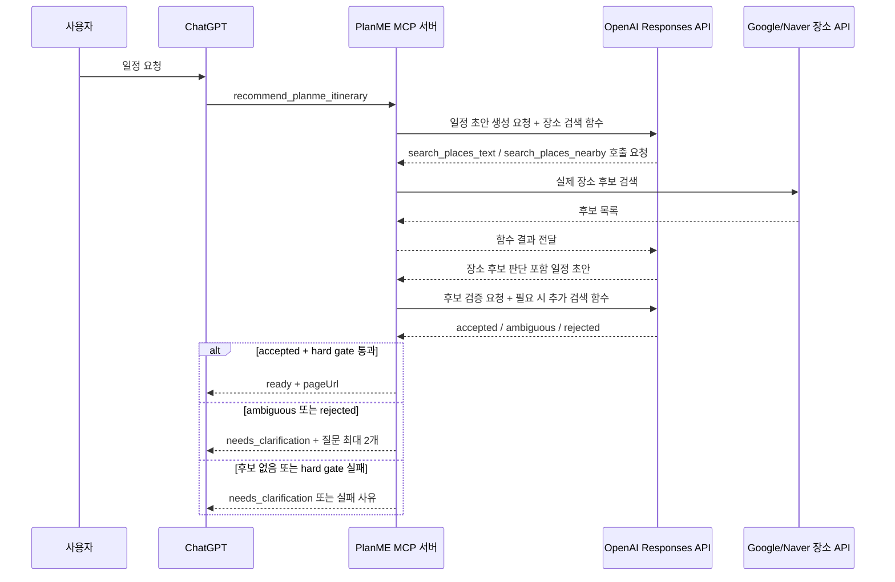

# AI 장소 후보 검증 설계

## 결론

PlanME 일정 생성은 OpenAI Function Calling을 중심으로 장소를 검색하고 판단한다. OpenAI 모델은 `search_places_text`, `search_places_nearby` 함수 호출을 요청하고, PlanME 서버는 Google/Naver 장소 API를 실행해 후보를 돌려준다. 모델은 후보가 사용자 의도에 맞는지 `accepted`, `ambiguous`, `rejected`로 판단하고, 코드는 좌표와 `placeId` 또는 검색 출처 hard gate만 강제한다.

기존 Google Places 1순위 자동 대체는 사용하지 않는다. 검색 후보가 없거나 hard gate를 통과하지 못하면 상세 링크와 위젯을 만들지 않는다.

## 배경

현재 문제는 AI가 만든 장소명이 실제 장소 검색 결과와 연결되지 않는다는 점이다. 예를 들어 `거제도 바다 낚시터` 같은 일반 표현은 지도 좌표가 없는 문장일 수 있다. 이 상태로 링크를 만들면 지도 마커, 경로 계산, 대중교통 표시가 모두 흔들린다.

Google/Naver API는 장소 존재와 좌표를 확인할 수 있지만, 검색 1순위가 사용자 의도와 맞는지는 보장하지 않는다. 그래서 검색 실행은 서버가 하고, 후보 적합성 판단은 OpenAI 모델이 한다.

관련 근거:

- `01_interview/ai-place-validation.md`: Function Calling은 초안 생성 단계와 후보 검증 단계 모두에 적용
- `packages/planme-core/src/openai-itinerary-generator.ts`: 현재 OpenAI Responses API 호출 위치
- `packages/planme-core/src/place-candidates.ts`: 현재 Google Places 후보 검색 구현
- `packages/planme-core/src/gpt-actions.ts`: MCP 추천 일정 생성과 clarification 분기 위치

## 목표와 비목표

목표:

- 일정 초안 생성 단계에서 모든 장소를 Function Calling 기반 검색으로 확인한다.
- 후보 검증 단계에서 AI가 검색 후보의 사용자 의도 적합성을 판단한다.
- 코드는 좌표와 `placeId` 또는 검색 출처만 hard gate로 확인한다.
- `ambiguous` 또는 `rejected`이면 링크와 위젯 없이 ChatGPT 대화에서만 되묻는다.
- 되묻기는 최대 2라운드이며, 그 뒤에도 애매하면 마지막 검색 1회 후 내부 AI가 최후 확정한다.
- 마지막 검색 후보가 없거나 hard gate를 통과하지 못하면 최후 확정하지 않는다.
- 호출량은 Redis/Upstash 일별 카운터에 저장한다.

비목표:

- 사용자가 웹 화면에서 후보를 직접 고르는 위젯
- AI가 외부 API 결과 없이 장소 존재와 좌표를 추정하는 방식
- 기존 Google Places 1순위 자동 대체 fallback
- 거리 기준으로 의도 적합성을 hard gate 하는 방식
- `geocode_place`, `get_place_details` 함수의 초기 도입

## 전체 흐름



## Function Tools

### search_places_text

목적: 텍스트 질의로 장소 후보를 검색한다.

```ts
type SearchPlacesTextInput = {
  query: string;
  region?: string;
  userIntent?: string;
  center?: MapCoordinate;
  maxCandidates?: number;
};
```

규칙:

- 후보 반환 기본값은 5개, 최대값은 10개이다.
- `query`에는 사용자의 원래 표현과 지역 맥락을 함께 넣을 수 있다.
- Google Places Text Search를 우선 사용하고, 구현 가능 범위에서 Naver 검색/지오코딩 결과를 같은 후보 모델로 정규화한다.
- 결과를 검색 순위만으로 자동 채택하지 않는다.

### search_places_nearby

목적: 목적지, 숙소, 이미 확정된 장소 같은 기준 좌표 주변 후보를 검색한다.

```ts
type SearchPlacesNearbyInput = {
  center: MapCoordinate;
  query?: string;
  region?: string;
  userIntent?: string;
  radiusMeters: number;
  maxCandidates?: number;
};
```

규칙:

- 후보 반환 기본값은 5개, 최대값은 10개이다.
- 최대 반경은 20km를 넘지 않는다.
- Nearby Search는 Text Search 결과가 없거나, 기준 좌표 주변 장소가 더 자연스러운 의도일 때 사용한다.
- 반경 확대 순서와 호출 횟수는 구현 계획에서 실제 장소 수와 일정 일수를 기준으로 제한한다.

## 후보 모델

```ts
type PlaceSearchSource =
  | "google_text_search"
  | "google_nearby_search"
  | "naver_geocode"
  | "input";

type PlanmePlaceCandidate = {
  candidateId: string;
  name: string;
  address?: string;
  coordinate: MapCoordinate;
  placeId?: string;
  source: PlaceSearchSource;
  sourceRef: string;
  query?: string;
  radiusMeters?: number;
  types?: string[];
};
```

`placeId`는 Google 후보에서 우선 사용한다. Naver 결과처럼 `placeId`가 없는 후보는 `source`와 `sourceRef`로 검색 출처를 보존한다. `sourceRef`는 provider, query, provider 응답 식별자, 좌표를 조합해 재현 가능한 값으로 만든다.

## AI 판단 출력

```ts
type PlaceDecisionStatus = "accepted" | "ambiguous" | "rejected";

type PlaceCandidateDecision = {
  status: PlaceDecisionStatus;
  originalPlaceName: string;
  selectedCandidateId?: string;
  reason: string;
  questions?: string[];
  feedbackNeeded?: boolean;
  feedbackMessage?: string;
};
```

규칙:

- `accepted`이면 `selectedCandidateId`가 필요하다.
- `ambiguous` 또는 `rejected`이면 `questions`는 최대 2개까지만 허용한다.
- 질문은 장소 후보 선택지가 아니라 사용자 의도 확인 질문일 수 있다. 예를 들어 장소 후보는 낚시터이고, 질문은 낚시 장르일 수 있다.
- `feedbackMessage`는 ChatGPT 대화에만 표시한다. PlanME 일정 페이지에는 최종 장소를 자연스럽게 표시한다.

## Hard Gate

코드가 강제하는 최소 조건:

- 좌표가 있다.
- `placeId` 또는 검색 출처가 있다.

코드가 지금 강제하지 않는 조건:

- 목적지와의 거리 기준
- 검색 순위
- 카테고리 일치 점수
- AI confidence 점수

hard gate 실패 시:

- 상세 링크를 만들지 않는다.
- 위젯을 만들지 않는다.
- preview store에 저장하지 않는다.
- MCP 응답은 실패 이유를 model-visible structured content로 돌려준다.

## Clarification 라운드

라운드 상태는 서버 저장소에 별도 세션으로 저장하지 않는다. ChatGPT가 다음 MCP 호출에 넘길 수 있는 `clarificationContext`로 이어간다. 서버는 Redis/Upstash에 일별 호출량 카운터만 저장한다.

```ts
type PlanmeClarificationContext = {
  round: number;
  originalRequest?: RecommendItineraryRequest;
  unresolvedPlaces: string[];
  previousQuestions: string[];
  previousAnswers: string[];
};
```

처리 규칙:

1. 최초 `ambiguous` 또는 `rejected`이면 `round = 1`로 질문을 반환한다.
2. 사용자 답변이 오면 이전 후보만 재평가하지 않고, 답변을 포함해 다시 검색한다.
3. 최대 2라운드까지만 되묻는다.
4. 2라운드 후에도 애매하면 마지막 검색을 1회 실행한다.
5. 마지막 검색 후보가 있으면 내부 AI가 최후 확정할 수 있다.
6. 마지막 검색 후보가 없거나 hard gate 실패면 링크를 만들지 않는다.

`originalRequest`는 다음 MCP 요청의 일반 입력 필드와 중복되면 생략할 수 있다.

## Failure And Retry

- OpenAI Function Calling 흐름이 깨지거나 모델이 검색 함수를 호출하지 않으면 OpenAI 요청을 1회 재시도한다.
- 재시도 후에도 검색 후보를 확보하지 못하면 기존 1순위 자동 대체 fallback을 사용하지 않는다.
- Google/Naver API 장애로 후보가 없으면 hard gate 실패로 처리한다.
- 일부 후보만 실패하면 실패한 장소만 unresolved로 남기고 `needs_clarification`을 반환한다.

## Daily Usage Counters

Redis/Upstash 일별 카운터에 다음 항목을 저장한다.

- OpenAI 요청 횟수
- Function Calling 장소 검색 호출 횟수
- Google Places 호출 횟수
- Naver 호출 횟수
- ODsay 호출 횟수
- 일정 생성 성공 건수
- `needs_clarification` 발생 건수
- 최후 확정 발생 건수
- hard gate 실패 건수

키 구조와 보존 기간은 구현 계획에서 정한다.

## 리스크

- Function Calling 호출 루프가 길어지면 OpenAI와 장소 API 호출량이 늘어난다. 외부 API 실제 검증은 사용자 승인 후에만 실행한다.
- `clarificationContext`를 ChatGPT 호출 인자로 이어가는 방식은 서버 구현이 단순하지만, 호출자가 컨텍스트를 누락하면 라운드 추적이 약해진다.
- Naver 결과에 `placeId`가 없으면 `sourceRef` 품질이 중요하다. 재현 가능한 출처 식별자를 구현해야 한다.

## 검증 연결

- 초안 생성 단계에서 모든 장소가 Function Calling 기반 검색으로 확인된다.
- 후보 검증 단계에서 AI가 `accepted`, `ambiguous`, `rejected`를 반환한다.
- 기존 Google Places 1순위 자동 대체 로직은 사용하지 않는다.
- 좌표 없는 장소는 링크로 저장되지 않는다.
- `placeId` 또는 검색 출처 없는 장소는 링크로 저장되지 않는다.
- `ambiguous` 또는 `rejected`이면 링크와 위젯 없이 ChatGPT 대화에서 최대 2개 질문을 반환한다.
- 외부 API 테스트는 실행 전 예상 호출량을 안내하고 승인받는다.
