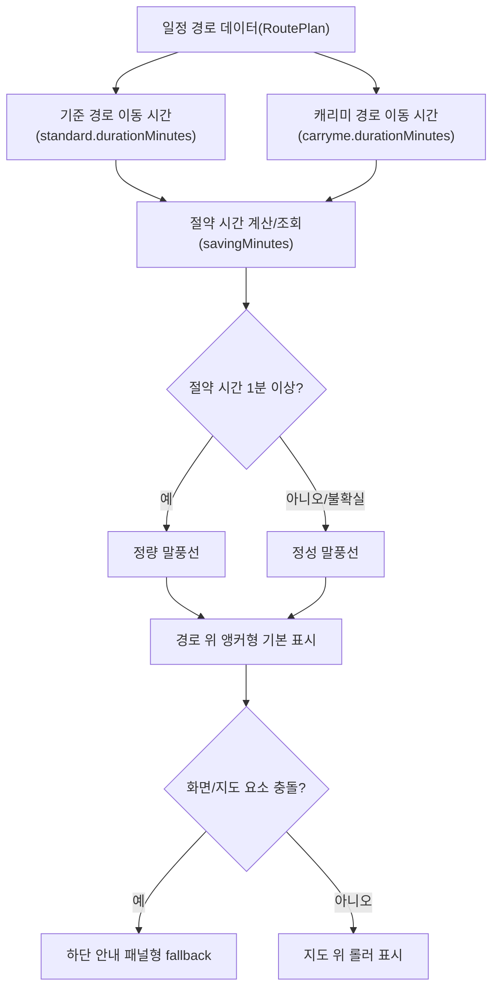

# PlanME 롤러 메시지 방향성 설계

## 결론

GUI-134(PlanME 지도 화면 롤러 캐릭터 메시지 방향성 분석)는 `B 기본 + C fallback` 방향으로 진행한다.

기본 화면에서는 지도 위 캐리미 경로(CarryME route) 근처에 롤러 캐릭터와 말풍선을 앵커링한다. 모바일 화면, 지도 컨트롤, 저작권 영역, 경로선과 충돌하는 상황에서는 하단 안내 패널(bottom guidance panel)로 전환한다.

## 배경

PlanME는 실시간 네비게이션(navigation)이 아니라 여행계획과 동선 실행을 보조하는 서비스다.

롤러 캐릭터는 턴바이턴 길안내(turn-by-turn navigation), 위치 기반 경로 이탈 감지(off-route detection), 실시간 경로 재탐색(rerouting)을 담당하지 않는다. 롤러는 캐리미 효과(CarryME benefit)를 지도 화면에서 눈에 띄게 전달하는 브랜드 가이드(brand guide) 역할로 정의한다.

## 화면 방향

### 기본: 경로 위 앵커형

지도 위 캐리미 경로(CarryME route) 주변에 롤러 캐릭터를 배치하고, 말풍선은 해당 경로의 혜택을 설명한다.

이 방식은 사용자가 지도와 메시지를 한 화면에서 연결해 이해하기 쉽다. 다만 작은 화면에서는 말풍선이 지도 컨트롤, 저작권, 경로선, 장소 마커와 겹칠 수 있으므로 충돌 감지가 필요하다.

### 대체: 하단 안내 패널형

화면 폭이 좁거나 지도 요소와 겹침이 예상되면 하단 안내 패널(bottom guidance panel)에 롤러 캐릭터와 문구를 표시한다.

이 방식은 네비게이션 오해가 적고 모바일 안정성이 높다. 대신 롤러가 지도 위에서 움직이는 느낌은 줄어들기 때문에 기본 상태가 아니라 fallback으로 사용한다.

## 문구 조건

절약 시간(savingMinutes)이 1분 이상이면 정량 메시지를 사용한다.

예시:

- `CarryME로 짐을 먼저 보내두면 약 70분 더 여유로워요.`
- `짐은 CarryME가 이동 중이에요. 관광 시간이 약 70분 늘어났어요.`

절약 시간(savingMinutes)이 없거나 계산값을 신뢰하기 어려우면 편의성 중심 정성 메시지를 사용한다.

예시:

- `짐 없이 편하게 관광할 수 있어요.`
- `짐은 CarryME가 맡고, 여행자는 가볍게 이동해요.`

정량 메시지는 기존 기준 경로 이동 시간(standard.durationMinutes), 캐리미 경로 이동 시간(carryme.durationMinutes), 절약 시간(savingMinutes)을 재사용한다. 신규 시간 계산 산식은 이 이슈 범위에 포함하지 않는다.

## 롤러 상태

초기 구현 준비 범위에서는 롤러 이미지 상태를 2종으로 제한한다.

- 시간 절약 강조 상태(time-saving state): 날고 있는 롤러 이미지
- 편의성 강조 상태(comfort state): 하트 또는 안정감 있는 롤러 이미지

상태를 과하게 늘리면 네비게이션 캐릭터처럼 보일 수 있으므로, 경로 안내보다 캐리미 메시지 전달에 집중한다.

## 데이터 흐름

## 제외 범위

- 실시간 턴바이턴 길안내(turn-by-turn navigation)
- 위치 기반 경로 이탈 감지(off-route detection)
- 실시간 경로 재탐색(rerouting)
- 신규 시간 절약 산식 정의
- 복잡한 롤러 애니메이션 시스템
- 롤러 이미지 신규 제작 또는 라이선스 검토

## 수용 기준

- 기본 방향은 경로 위 앵커형으로 정의된다.
- 모바일 또는 지도 요소 충돌 상황에서는 하단 안내 패널형으로 전환한다.
- 정량 메시지는 절약 시간(savingMinutes)이 1분 이상일 때만 사용한다.
- 절약 시간이 없거나 불확실하면 편의성 중심 정성 메시지를 사용한다.
- 롤러는 네비게이션 안내자가 아니라 캐리미 메시지 전달 브랜드 가이드로 표현한다.
- 신규 시간 계산 산식을 만들지 않고 기존 시간 비교 값을 재사용한다.

## 리스크

- 지도 위 오버레이가 네이버 지도 저작권/컨트롤 영역을 침범하면 운영 리스크가 생긴다.
- `Follow me` 같은 문구는 실시간 네비게이션으로 오해될 수 있다.
- 정량 메시지가 실제 계산값과 다르면 CarryME 효과를 과장하는 표현이 된다.
- 롤러 이미지 원본 품질과 사용 권한은 별도 확인이 필요하다.
