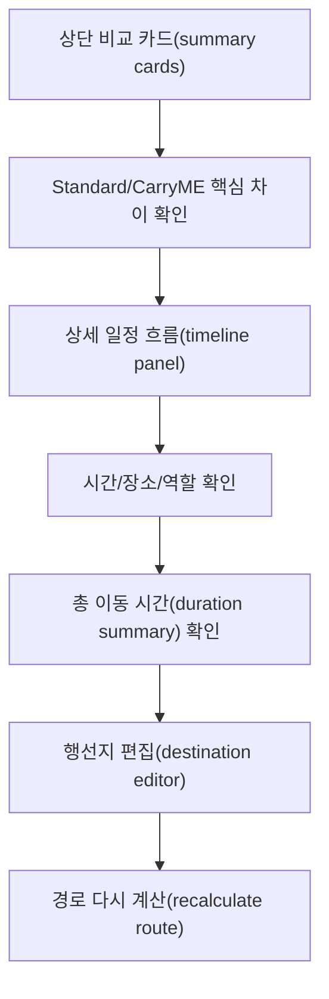

# PlanME 경로 비교 일정 흐름 배치 설계

## 결론

PlanME 상세 화면의 Standard/CarryME 비교 영역은 상단 비교 카드(summary cards)를 요약 전용으로 유지하고, 상세 일정 흐름(timeline panel)은 행선지 편집(destination editor) 위에 별도 패널로 배치한다.

상단 경로 칩(mini-flow chips)은 제거하고, 총 이동 시간(duration summary)은 각 상세 일정 흐름 하단에 배치한다.

## 배경

기존 비교 카드(compare card)는 행선지가 4개 이상일 때 목적지 칩, 화살표, 다음 목적지 간격이 어색하게 줄바꿈된다.

특히 마지막 도착지가 다음 줄로 내려가면 화살표와 목적지가 분리되어 보이고, 사용자는 경로 순서를 한 번에 읽기 어렵다. 비교 카드는 요약만 보여주고, 실제 순서와 시간은 더 넓은 상세 일정 흐름 영역에서 보여주는 편이 안정적이다.

## 화면 구조

### 상단 비교 카드

상단 비교 카드는 Standard 일정과 CarryME 일정의 핵심 차이만 보여준다.

- Standard 일정: 경로 제목과 수하물 보관 설명
- CarryME 일정: 경로 제목과 CarryME 배송 설명

상단 비교 카드에서는 상단 경로 칩(mini-flow chips)과 총 이동 시간(duration summary)을 제거한다.

### 상세 일정 흐름 패널

상세 일정 흐름 패널은 Standard 일정과 CarryME 일정을 2열로 보여준다.

각 열은 세로 일정 흐름(vertical timeline)으로 표시하고, 시간, 장소명, 역할 설명을 함께 보여준다. 행선지가 4개 이상이어도 줄바꿈된 화살표보다 흐름을 안정적으로 읽을 수 있다.

각 열 하단에는 총 이동 시간(duration summary)을 배치한다.

- Standard 총 이동 시간: Standard 일정 흐름 하단
- CarryME 총 이동 시간: CarryME 일정 흐름 하단
- 절약 시간(savingMinutes): CarryME 총 이동 시간 우측 배지

### 행선지 편집

행선지 편집(destination editor)은 상세 일정 흐름 패널 아래에 둔다.

이 배치는 사용자가 먼저 확정된 비교 결과를 이해한 뒤, 필요하면 바로 아래에서 경유지와 교통수단을 수정하는 흐름을 만든다.

## 사용자 흐름

## 구현 방향

상단 비교 카드의 기존 목적지 나열 UI는 제거한다.

기존 우측 일정 패널에서 사용하던 세로 일정 UI를 재사용하되, 비교 카드 아래와 행선지 편집 위로 이동한다. 데스크톱에서는 2열을 유지하고, 모바일에서는 Standard 일정과 CarryME 일정을 세로로 쌓는다.

총 이동 시간(duration summary)은 일정 흐름 패널 내부 하단으로 이동한다. 이는 일정 흐름과 시간 요약을 한 덩어리로 읽게 하기 위한 배치다.

## 수용 기준

- 상단 비교 카드에는 경로 제목과 설명만 남는다.
- 상단 경로 칩(mini-flow chips)은 표시하지 않는다.
- Standard/CarryME 상세 일정 흐름은 행선지 편집(destination editor) 위에 표시된다.
- 총 이동 시간(duration summary)은 각 상세 일정 흐름 하단에 표시된다.
- CarryME 절약 시간(savingMinutes)은 CarryME 총 이동 시간과 같은 줄 또는 같은 박스 안에서 표시된다.
- 행선지가 4개 이상이어도 화살표와 다음 목적지가 분리되어 어색하게 보이지 않는다.
- 모바일 화면에서는 일정 흐름 패널이 세로로 쌓이고, 텍스트가 부모 영역을 넘치지 않는다.

## 제외 범위

- 경로 계산 산식 변경
- Standard/CarryME 경로 데이터 구조 변경
- 지도 경로선(polyline) 계산 변경
- 롤러 캐릭터 오버레이 배치 변경
- 결제 또는 실제 CarryME 예약 기능 변경

## 리스크

- 기존 우측 일정 패널과 중복 노출되면 같은 정보가 두 번 보일 수 있으므로, 배치 변경 시 한 화면 내 정보 중복을 정리해야 한다.
- 상세 일정 흐름 패널이 커지면 행선지 편집 진입 위치가 아래로 밀릴 수 있다.
- 모바일에서는 Standard 일정과 CarryME 일정이 길게 쌓이므로, 탭 또는 접기 UI가 추가로 필요할 수 있다.
- 총 이동 시간(duration summary)을 상단에서 제거하면 빠른 비교성이 줄어들 수 있으므로, 상세 일정 흐름 패널 상단 제목과 하단 요약의 시각적 연결이 필요하다.
