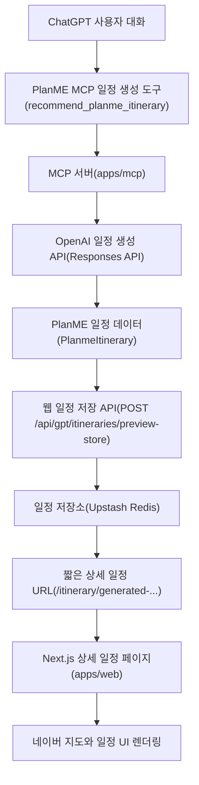

# PlanME MCP 전용 AI 일정 생성 설계

## 결론

PlanME 일정 생성은 MCP 서버(apps/mcp)에서만 수행한다.

Next.js 웹(apps/web)은 상세 일정 페이지 렌더링, 지도 표시, 저장된 일정 조회만 담당한다. OpenAI 서버 키(OPENAI_API_KEY)는 MCP 배포 환경에만 둔다.

## 배경

현재 PlanME에는 일정 생성 진입점이 세 개 있다.

- MCP 일정 생성 도구(recommend_planme_itinerary)
- 웹 GPT 일정 생성 API(POST /api/gpt/itineraries/recommend)와 웹 계획 생성 API(POST /api/plan)
- 웹 일반 OpenAPI 스키마(GET /api/openapi)와 웹 GPT OpenAPI 스키마(GET /api/gpt/openapi)

실제 실행 엔드포인트인 MCP 일정 생성 도구와 웹 일정 생성 API는 공통 일정 생성 함수(createAiRecommendedItineraryResponse)를 호출한다. 이 함수는 일정 초안(days)이 없으면 OpenAI 일정 생성 함수(generatePlanmeDraftWithOpenAi)를 호출하고, 이때 OpenAI 서버 키(OPENAI_API_KEY)가 필요하다.

이 구조 때문에 ChatGPT가 MCP가 아니라 웹 GPT 일정 생성 API를 호출하거나, 로컬에서 웹 계획 생성 API를 테스트하면 Next.js 웹에도 OpenAI 서버 키가 필요해진다.

## 목표

- 일정 생성 책임을 MCP 서버로 단일화한다.
- OpenAI 서버 키(OPENAI_API_KEY)는 MCP Vercel 프로젝트에만 둔다.
- Next.js 웹 배포 환경에서는 OpenAI 서버 키가 없어도 상세 일정 페이지가 동작해야 한다.
- ChatGPT에서 상세 일정 열기 버튼은 짧은 일정 상세 URL(/itinerary/generated-...)로 이동해야 한다.
- 저장된 AI 생성 일정 데이터가 없으면 상세 일정 페이지는 기존 데모 fallback으로 대체하지 않고 404 또는 일정 만료 화면을 보여준다.

## 제외 범위

- 지도 렌더링 방식 변경
- 네이버 지도 API 키(NEXT_PUBLIC_NAVER_MAPS_CLIENT_ID) 변경
- 오디세이 경로 API 키(NEXT_PUBLIC_ODSAY_API_KEY) 변경
- 일정 추천 프롬프트 품질 개선
- 숙소/관광지 검색 품질 개선
- ChatGPT 대화 모델이 직접 만든 일정 초안(days)을 받는 방식으로 회귀
- 압축 데이터 URL(preview?data=...) 방식 복구

## 대상 아키텍처

Next.js 웹은 OpenAI 일정 생성 API를 호출하지 않는다. 웹은 일정 저장소에서 일정 데이터를 읽고 화면을 그리는 역할만 맡는다.

## 책임 분리

### MCP 서버(apps/mcp)

- 사용자 요청을 받아 일정 생성을 시작한다.
- 입력이 부족하면 질문 유도 도구(start_planme_planning)로 추가 정보를 요청한다.
- 입력이 충분하면 MCP 일정 생성 도구(recommend_planme_itinerary)가 OpenAI 일정 생성 API를 호출한다.
- MCP 일정 생성 도구(recommend_planme_itinerary)는 일정 초안(days)을 입력으로 받지 않는다.
- ChatGPT 작성 초안 렌더링 도구(preview_planme_itinerary, update_planme_itinerary_preview, commit_planme_itinerary)는 MCP 전용 AI 생성 방향에서는 제거하거나 비공개 처리한다.
- 생성된 일정을 웹 일정 저장 API(POST /api/gpt/itineraries/preview-store)에 전달한다.
- 웹 일정 저장 API는 저장 전용이어야 하며 일정 생성은 수행하지 않는다.
- ChatGPT 위젯에 표시할 요약과 상세 일정 URL을 반환한다.

### Next.js 웹(apps/web)

- 상세 일정 페이지(/itinerary/[id])를 렌더링한다.
- 저장된 일정 조회 API(GET /api/gpt/itineraries/{itineraryId})와 공유 URL API(POST /api/gpt/itineraries/{itineraryId}/share)는 유지한다.
- 일정 저장 API(POST /api/gpt/itineraries/preview-store)는 MCP가 생성한 일정을 상세 페이지에서 다시 열기 위한 저장 전용 API로 유지한다.
- 운영 환경의 일정 저장 API(POST /api/gpt/itineraries/preview-store)는 일정 저장소(Upstash Redis) 저장 실패나 환경변수 누락을 메모리 저장 성공으로 대체하지 않는다.
- 웹 GPT 일정 생성 API(POST /api/gpt/itineraries/recommend)는 MCP 전용 정책을 안내하는 차단 응답으로 전환한다.
- 웹 계획 생성 API(POST /api/plan)는 MCP 사용 안내 응답으로 전환한다.
- 웹 GPT OpenAPI 스키마(GET /api/gpt/openapi)는 ChatGPT가 웹 일정 생성 API를 호출하지 않도록 일정 생성 operation을 제거한다.
- 웹 일반 OpenAPI 스키마(GET /api/openapi)는 웹 계획 생성 API(POST /api/plan) operation을 제거한다.

## 환경변수 정책

### MCP 배포 환경

- OpenAI 서버 키(OPENAI_API_KEY): 필수
- OpenAI 모델명(PLANME_OPENAI_MODEL): 선택
- 일정 상세 웹 원본(PLANME_WEB_ORIGIN): 현재 코드 상수로 고정되어 있으며, 환경별 도메인 분리가 필요하면 별도 환경변수화한다.

### Next.js 웹 배포 환경

- OpenAI 서버 키(OPENAI_API_KEY): 미설정
- 일정 저장소 URL(UPSTASH_REDIS_REST_URL): 운영 필수
- 일정 저장소 토큰(UPSTASH_REDIS_REST_TOKEN): 운영 필수
- 네이버 지도 클라이언트 ID(NEXT_PUBLIC_NAVER_MAPS_CLIENT_ID): 필요
- 오디세이 API 키(NEXT_PUBLIC_ODSAY_API_KEY): 필요

Next.js 웹에 OpenAI 서버 키가 없어도 상세 일정 페이지가 동작해야 한다. MCP 전용 전환 후에는 웹 사용자-facing 경로에서 OpenAI 서버 키 누락 503이 발생하지 않아야 한다.

## API 전환 정책

### 유지

- 상세 일정 페이지(/itinerary/[id])
- 저장된 일정 조회 API(GET /api/gpt/itineraries/{itineraryId})
- 일정 공유 URL API(POST /api/gpt/itineraries/{itineraryId}/share)
- 일정 저장 API(POST /api/gpt/itineraries/preview-store)

### 차단 또는 축소

- 웹 GPT 일정 생성 API(POST /api/gpt/itineraries/recommend)
- 웹 계획 생성 API(POST /api/plan)
- 웹 GPT OpenAPI 스키마(GET /api/gpt/openapi)의 일정 생성 operation
- 웹 일반 OpenAPI 스키마(GET /api/openapi)의 웹 계획 생성 API(POST /api/plan) operation

차단 응답은 410 Gone으로 통일한다. ChatGPT 설정에서 잘못된 Action이 남아 있을 때 원인을 바로 알 수 있어야 하므로, 응답 본문에는 "PlanME 일정 생성은 MCP 도구만 지원한다"는 문장을 포함한다.

## 데이터 흐름

1. ChatGPT가 사용자에게 목적지, 출발지, 기간 등 필수 입력을 확인한다.
2. ChatGPT가 MCP 일정 생성 도구(recommend_planme_itinerary)를 호출한다.
3. MCP 서버가 OpenAI 일정 생성 API를 호출해 일정 초안을 만든다.
4. MCP 서버가 생성 결과를 PlanME 일정 데이터로 변환한다.
5. MCP 서버가 웹 일정 저장 API(POST /api/gpt/itineraries/preview-store)에 일정 저장을 요청한다.
6. Next.js 웹이 일정 저장소(Upstash Redis)에 일정 데이터를 저장한다.
7. MCP 서버가 저장 성공을 확인한 뒤 ChatGPT 위젯 데이터와 상세 일정 URL을 반환한다.
8. 사용자가 상세 일정 열기 버튼을 누르면 Next.js 상세 일정 페이지가 일정 저장소에서 데이터를 읽어 렌더링한다.

## 실패 처리

- MCP 서버에 OpenAI 서버 키(OPENAI_API_KEY)가 없으면 MCP 도구가 명시적 설정 오류를 반환한다.
- MCP 서버가 웹 일정 저장 API를 통해 저장 성공을 확인하지 못하면 상세 일정 URL이 깨질 수 있으므로, MCP 응답은 저장 성공 후에만 상세 일정 URL을 확정한다.
- 운영 환경에서 웹 일정 저장 API가 일정 저장소(Upstash Redis)에 쓰지 못하면 5xx를 반환한다. 메모리 저장소 fallback은 로컬 개발에서만 허용한다.
- Next.js 웹이 AI 생성 일정 ID를 일정 저장소에서 찾지 못하면 기존 데모 fallback을 쓰지 않고 404 또는 "일정 만료" 화면을 보여준다.
- 웹 GPT 일정 생성 API가 호출되면 OpenAI를 호출하지 않고 MCP 전용 안내 오류를 반환한다.

## 테스트 기준

- MCP 일정 생성 도구(recommend_planme_itinerary)는 일정 초안(days) 없이도 OpenAI 일정 생성 API를 호출해 실제 지역 기반 일정을 만든다.
- Next.js 웹 배포 환경에서 OpenAI 서버 키(OPENAI_API_KEY)를 제거해도 상세 일정 페이지(/itinerary/generated-...)가 정상 렌더링된다.
- 웹 GPT 일정 생성 API(POST /api/gpt/itineraries/recommend)는 OpenAI를 호출하지 않고 MCP 전용 안내 응답을 반환한다.
- 웹 계획 생성 API(POST /api/plan)는 OpenAI를 호출하지 않고 MCP 전용 안내 응답을 반환한다.
- 웹 GPT OpenAPI 스키마(GET /api/gpt/openapi)는 ChatGPT가 웹 일정 생성 API를 새로 등록하지 못하도록 생성 operation을 노출하지 않는다.
- 웹 일반 OpenAPI 스키마(GET /api/openapi)는 웹 계획 생성 API(POST /api/plan)를 새로 등록하지 못하도록 생성 operation을 노출하지 않는다.
- MCP가 저장한 상세 일정 URL은 압축 데이터 쿼리(preview?data=...)가 아니라 짧은 상세 일정 URL(/itinerary/generated-...)이다.
- 상세 일정 페이지는 네이버 지도 클라이언트 ID(NEXT_PUBLIC_NAVER_MAPS_CLIENT_ID)를 계속 사용한다.
- MCP가 일정 저장에 실패하면 상세 일정 URL을 성공 응답처럼 반환하지 않는다.
- 운영 환경의 웹 일정 저장 API(POST /api/gpt/itineraries/preview-store)는 일정 저장소(Upstash Redis) 실패를 메모리 fallback 성공으로 바꾸지 않는다.
- MCP 일정 생성 도구(recommend_planme_itinerary)는 일정 초안(days) 입력 없이 서버 AI 생성만 수행한다.
- ChatGPT 작성 초안 렌더링 도구(preview_planme_itinerary, update_planme_itinerary_preview, commit_planme_itinerary)는 제거되거나 비공개 처리된다.
- 기존 웹 E2E 테스트(gpt-itinerary-generation.spec.ts)는 웹 생성 API 성공이 아니라 웹 생성 API 차단, 저장된 일정 조회, OpenAI 서버 키 없는 상세 페이지 렌더링을 검증하도록 전환한다.

## 운영 리스크

- ChatGPT 설정에 기존 웹 GPT Action이 남아 있으면 웹 API를 계속 호출할 수 있다. 배포 후 GPT 설정에서 웹 Action을 제거하고 MCP 앱만 연결해야 한다.
- 일정 저장소(Upstash Redis)가 Next.js 웹 배포 환경에 없거나 메모리 fallback으로 동작하면 상세 일정 URL이 안정적으로 열리지 않는다.
- 현재 웹 저장 함수(savePreviewItinerary)는 Upstash 저장 실패 시 메모리 저장으로 성공 응답을 만들 수 있다. MCP 전용 전환에서는 운영 환경의 저장 API가 fail-closed로 동작해야 한다.
- 현재 MCP 저장 보조 함수(persistItineraryForDetailPage)는 저장 실패를 로그로만 남기고 계속 진행한다. MCP 전용 전환에서는 이 동작을 성공/실패가 드러나는 저장 경계로 바꿔야 한다.
- MCP가 저장 실패 상태에서도 상세 일정 URL을 반환하면 사용자는 404 또는 엉뚱한 fallback 일정을 보게 된다.
- 웹 GPT 일정 생성 API를 갑자기 차단하면 기존 테스트나 문서가 실패할 수 있다. 테스트 명세와 문서를 같이 갱신해야 한다.
- 기존 Custom GPT Actions 문서(docs/custom-gpt-actions.md)는 웹 GPT 일정 생성 API를 안내하므로 MCP 전용 안내 문서로 갱신해야 한다.
- Next.js 웹에서 OpenAI 서버 키를 완전히 제거하면 웹 단독 API 테스트는 불가능해진다. 앞으로 AI 생성 테스트는 MCP 로컬 서버 또는 MCP 배포 환경 기준으로 수행해야 한다.

## 롤백 기준

아래 중 하나가 발생하면 MCP 전용 전환을 중단하고 이전 웹 생성 경로를 임시 복구한다.

- ChatGPT MCP 연결이 배포 환경에서 안정적으로 동작하지 않는다.
- Next.js 웹이 일정 저장소(Upstash Redis)에 AI 생성 일정을 안정적으로 저장하지 못한다.
- 상세 일정 URL이 안정적으로 저장/조회되지 않는다.
- 기존 시연 일정 생성 흐름이 웹 Action에 강하게 묶여 있어 단기간 제거가 어렵다.

롤백하더라도 압축 데이터 URL(preview?data=...) 방식은 되살리지 않는다. 상세 일정 URL은 짧은 URL(/itinerary/generated-...) 정책을 유지한다.

## 구현 계획으로 넘길 항목

- 웹 GPT 일정 생성 API(POST /api/gpt/itineraries/recommend) 차단 응답 전환
- 웹 계획 생성 API(POST /api/plan) 차단 응답 전환
- 웹 GPT OpenAPI 스키마(GET /api/gpt/openapi)에서 일정 생성 operation 제거
- 웹 일반 OpenAPI 스키마(GET /api/openapi)에서 웹 계획 생성 API(POST /api/plan) operation 제거
- MCP 일정 생성 도구(recommend_planme_itinerary)의 저장 성공 보장
- MCP 일정 생성 도구(recommend_planme_itinerary)의 일정 초안(days) 입력 제거
- ChatGPT 작성 초안 렌더링 도구(preview_planme_itinerary, update_planme_itinerary_preview, commit_planme_itinerary) 제거 또는 비공개 처리
- 웹 일정 저장 API(POST /api/gpt/itineraries/preview-store)의 저장 전용 역할 유지
- 운영 환경에서 웹 일정 저장 API(POST /api/gpt/itineraries/preview-store)의 메모리 fallback 성공 금지
- Next.js 웹 일정 저장소 환경변수 정합성 확인
- 상세 일정 조회 실패 시 AI 생성 URL은 404 또는 일정 만료 화면으로 처리
- MCP 기준 로컬/배포 테스트 스크립트 갱신
- 기존 웹 E2E 테스트(gpt-itinerary-generation.spec.ts)와 Custom GPT Actions 문서(docs/custom-gpt-actions.md) 갱신
